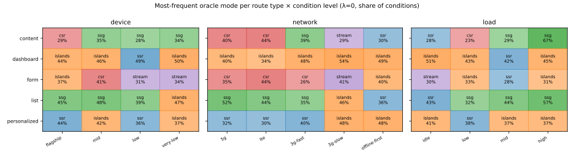
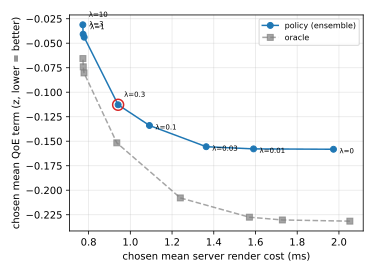

# 런타임 컨텍스트 적응형 렌더링 모드 선택 — 서로게이트 회귀 기반 정책의 학습과 엣지 서빙

**초안 v0.2 (2026-08-21).** 목차는 [paper-outline.md](paper-outline.md)를 따른다. 모든 수치는
본수집 `grid-v1`(2026-08-14 → 08-17, 10,400셀·311,108행)과 체크인된 리포트
`training/reports/grid-v1*.json`에서 나왔다. §7.3의 crosstab·원지표 중앙값과 그림 7-1·7-2는
`training/scripts/paper_figures.py`가 같은 데이터에서 재생성한다(출력:
`reports/grid-v1.rq1-crosstab.json`, `docs/figures/`). 수행하지 않은 실험은 본문에서 지어내지
않고 §8.2(위협 요인)와 §9(향후 연구)에 명시했다. v0.1 대비: 전보체 문장을 논문 산문으로 확장,
그림 2점·부록 E crosstab·부록 C 비용 추가, §7.3 원지표 중앙값을 재계산 스크립트 출력으로 교정
(정성 결론 불변), 참고문헌 번호 서식화.

---

## Abstract

현대 웹 프레임워크는 렌더링 모드(CSR·SSR·SSG·Streaming SSR·Islands)를 라우트 단위로 빌드
시점에 고정한다. 그러나 어떤 모드가 사용자 경험(QoE)과 서버 비용 면에서 최선인지는 요청 시점의
디바이스 성능, 네트워크 품질, 서버 부하에 따라 달라진다. 본 연구는 최적 모드를 런타임 컨텍스트의
함수로 보고, 요청마다 모드를 고르는 정책을 학습·서빙하는 시스템을 설계·구현·평가한다. 하나의
Next.js 코드베이스에 다섯 모드를 동일 DOM으로 구현한 벤치마크 앱(SUT)을 두고, 디바이스 4 ×
네트워크 5 × 서버 부하 4 조건 격자에서 라우트별 실행 가능 모드 전부를 30회씩 측정하는 완전 요인
실험(10,400셀, 311,108행)을 AWS Fargate 20샤드로 수행했다. 비용
`J(x,m) = Σw·z_r(QoE) + λ·ServerCost`를 LightGBM 서로게이트로 회귀하고 argmin으로 모드를
고르며, λ는 예산 제약의 그림자 가격으로 해석한다. 라우트 홀드아웃 400조건에서 서로게이트 정책은
top-1 74.8%, 평균 regret 0.041로, 최선의 고정 모드(regret 0.495)와 규칙 기반
휴리스틱(0.447)을 10배 이상 앞섰다. λ 스윕은 λ=0.3에서 QoE 손실을 거의 내지 않고 서버 렌더
비용을 λ=0 대비 52% 줄이는 파레토 무릎을 보였다. 앙상블을 깊이 12 트리로 증류(R² 0.999, 잎
2,724, 687KB)해 Lambda@Edge에 내장했고, 추론 p95는 0.025ms로 TTFB 예산 2ms의 1%대다.
조용히 실패하는 측정·서빙 버그들과 이를 막는 게이트도 함께 보고한다.

---

## 1. 서론

### 1.1 배경

Next.js·Nuxt·Astro 같은 현대 웹 프레임워크는 한 애플리케이션 안에서 여러 렌더링 모드를
제공한다. 클라이언트가 전부 그리는 CSR, 서버가 HTML을 완성해 보내는 SSR, 빌드 시점에 미리
만들어 두는 SSG와 그 증분 재검증 변형인 ISR, 서버가 셸을 먼저 흘려보내는 Streaming SSR, 그리고
상호작용 컴포넌트만 하이드레이션하는 Islands가 그것이다. 그러나 이 선택의 **단위는 라우트이고
시점은 빌드**다. 개발자는 "이 페이지는 SSG, 저 페이지는 SSR"을 정적으로 정해 배포하고, 그
결정은 플래그십 폰에서 5G로 접속한 사용자와 저사양 기기에서 3G로 접속한 사용자에게 똑같이
적용된다. CSR과 SSR을 비교한 기존 연구들[8–13]도 대부분 단일 측정 조건에서 두세 모드의 로딩
시간을 재고 "SSR이 빠르다" 류의 고정된 결론을 내리는 데 그친다.

### 1.2 문제 제기

렌더링 모드의 비용 구조는 조건에 따라 뒤집힌다. CSR은 JS 번들의 다운로드·파싱·실행이
클라이언트에 실리므로 저사양 기기와 저대역폭 네트워크에서 불리하지만, 서버 CPU는 거의 쓰지
않는다. SSR과 Streaming SSR은 첫 바이트 시간(TTFB)이 서버 부하에 직접 노출된다. SSG는 캐시가
뜨거우면 압도적으로 빠르지만 그 우위가 캐시 상태에 종속된다. Islands는 하이드레이션 CPU를
줄이지만 서버 렌더 비용은 SSR과 같다. 요컨대 최적 모드 `m*`는 컨텍스트
`x`(디바이스·네트워크·서버 상태·라우트 특성)의 함수이며, 이를 빌드 타임 상수로 고정하는 것은
구조적 손실이다. 본 연구의 실측(§7.3)에서 이 역전은 가설이 아니라 관측이다: 25개 라우트
전부에서 조건에 따라 최적 모드가 바뀌었고, 좋은 네트워크에서 40% 이상의 조건에서 최적이던
CSR이 나쁜 네트워크에서는 0%로 떨어진다.

### 1.3 연구 질문 및 기여

- **RQ1** 조건에 따라 모드 우열이 실제로 갈리는가(divergence)?
- **RQ2** 학습된 정책이 고정 모드·프레임워크 기본값·휴리스틱 규칙을 이기는가?
- **RQ3** 엣지 추론 오버헤드(TTFB 증가 < 2ms)와 CDN 캐시 효율을 유지하며 서빙할 수 있는가?

기여는 다음과 같다.

1. 다섯 렌더링 모드를 **동일 DOM·동일 컴포넌트 그래프**로 구현한 단일 코드베이스 SUT와, 렌더
   결정(엣지/서버)과 성능 측정(브라우저)을 상관 ID로 조인하는 계측 설계(§4).
2. 반사실(counterfactual) 문제를 실험 설계로 우회하는 완전 요인 랩 수집 — 10,400셀 × 30반복,
   20샤드 병렬, 외생적으로 고정한 배경 부하, 재현성 통제(§5). 데이터셋 자체가 기여물이다.
3. 서로게이트 회귀 + argmin 정책, λ의 그림자 가격 해석, 라우트별 z-정규화 레이블, 깊이 12 트리
   증류(§3, §6)와 그 평가 — 정책 top-1 74.8%, 평균 regret 0.041, 베이스라인 대비 10배 이상
   개선(§7).
4. CloudFront 캐시 키를 클라이언트 힌트 버킷 하나로 접고 origin-request 시점에 추론하는 엣지
   서빙 설계 — 캐시 히트는 추론 비용을 전혀 내지 않으며, 미스 경로의 추론 p95는
   0.025ms다(§4.4, §7.6).
5. 실험 시스템에서 "조용히 통과하는" 실패의 목록과 각각을 막는 검증 게이트(§8.3).

### 1.4 논문 구성

2장에서 관련 연구를 정리하고, 3장에서 문제를 정식화한다. 4장은 시스템 설계, 5장은 실험 설계와
데이터 수집, 6장은 학습 파이프라인이다. 7장에서 세 연구 질문을 평가하고, 8장에서 해석·위협
요인·실패 사례를 논의한 뒤 9장에서 맺는다.

---

## 2. 관련 연구

### 2.1 CSR vs SSR 정적 비교

Iskandar et al.[8]은 CSR과 SSR의 로딩 성능을 웹 개발 관점에서 비교했고, Teknika의 사례
연구[9]는 Next.js 기반 사이트에서 CSR/SSR/SSG의 로딩 시간을 쟀다. 이 계열의 다른 비교
연구들[10–12]과 SSR 대 Streaming SSR의 하이드레이션을 분석한 국내 연구[13]까지, 공통 한계는
**단일 측정 조건**이다: 하나의 기기·네트워크·부하에서 모드들을 재고 고정된 우열을 보고한다.
본 연구의 RQ1은 바로 그 우열이 조건에 따라 역전됨을 완전 요인 격자로 보인다(§7.3) — 이들
연구의 결론이 틀렸다는 것이 아니라, 결론의 단위가 "모드"가 아니라 "모드 × 조건"이어야 한다는
것이다.

### 2.2 조건 적응형 렌더링·하이드레이션

가장 가까운 선행기술은 미국 특허 10,764,403[5]으로, 클라이언트 자원과 서버 이용률을 보고 SSR
여부를 결정한다 — 문제 설정이 본 연구와 거의 같으나, 결정이 수기 규칙이고 학습과 정량 평가가
없다. MRAH[1]는 디바이스·네트워크·컴포넌트 중요도에 따라 하이드레이션 순서를 조정하지만, 조정
대상이 모드 선택이 아니라 하이드레이션 스케줄이며 서버 부하 축이 없다. Osmani와 Schloss의
Adaptive Loading[4]은 Network Information API·Device Memory·Client Hints로 사용자 경험을
차등 제공하는 클라이언트 휴리스틱으로, 본 연구 특징 벡터의 직접적 원형이지만 렌더링 모드 자체는
고정한다. Energy-aware Web Browsing[6]은 회귀 모델로 로드 시간과 에너지를 예측한 뒤 argmin을
취하는 구조가 본 연구와 동일하나 선택 대상이 big.LITTLE 코어다. 이 밖에 ML을 클라이언트 렌더링
최적화에 적용한 연구[2], 대규모 플랫폼용 적응형 렌더링·데이터 오케스트레이션 모델[3], Islands와
resumability 계보를 정리한 서베이[7]가 있으나, 조건별 측정과 정책 학습을 결합한 것은 없다.

### 2.3 웹 성능 예측과 ML 기반 시스템 최적화

웹 페이지 성능 예측 모델의 실증 비교[21]는 트리 앙상블이 선형회귀·SVM·MLP보다 안정적으로
우수함을 보여 본 연구의 LightGBM 선택을 정당화하고, 2010–2024 체계적 문헌 조사[22]는 예측에
쓰인 특징들을 정리해 특징 선택의 근거가 된다. WebProphet[23]과 후속 연구[24]는 페이지 로드
성능 예측의 자동화를 다룬다. 시스템 쪽에서는 Pensieve[25]가 런타임 컨텍스트로 비디오 전송
정책을 강화학습하는 대표 사례로 QoE 목적함수 설계의 참고가 되었고, CherryPick[26]·Scout[27]·
Micky[28]는 성능 모델로 "충분히 좋은 구성"을 고르는 계열로 본 연구의 top-1/top-2 마진
논리(§3.4)와 통한다. Polaris[14]·Prophecy[15]·Shandian[17]·Klotski[18]는 페이지 로드를
시스템 수준에서 재구성하는 계보로 Streaming SSR의 시스템적 원형이며, Vesper[16]는 상호작용
가능 시점을 QoE 지표로 정식화했다. WebGaze[19]와 JSAnalyzer[20]는 각각 시선·JS 단순화 관점의
최적화다.

### 2.4 오프폴리시 평가와 반사실 문제

필드 데이터에서는 한 요청에 한 모드만 적용되므로 "다른 모드였다면?"은 관측되지 않는다. Li et
al.[30]의 IPS 계열, Dudík et al.[31]의 Doubly Robust 추정, Swaminathan과 Joachims[32]의
Counterfactual Risk Minimization은 성향(propensity)이 로깅된 무작위화 트래픽에서 비편향
오프폴리시 평가를 가능하게 한다. 본 연구는 두 단계 전략을 취한다: **랩 수집에서는 완전 요인으로
반사실을 직접 관측**하고(같은 조건 벡터에서 모든 실행 가능 모드를 측정), 필드 무작위화(트래픽의
5–10%에 무작위 모드 배정 + 성향 로깅)를 후속 OPE용으로 설계에 남긴다(§5.6).

**공백.** 조사한 어느 문헌도 (a) 5개 렌더링 모드를 한 SUT에서 (b) 디바이스 × 네트워크 × 서버
부하 격자로 측정하고 (c) 서로게이트 회귀 + argmin 정책을 학습해 (d) 엣지에서 2ms 미만
오버헤드로 서빙하는 조합을 다루지 않는다. 규칙 기반의 특허[5]와 하이드레이션 스케줄링의
MRAH[1]가 가장 가까우며, 둘 다 서버 부하 축과 학습이 없다 — 이 두 편이 본 연구의 정면 비교
대상이다.

---

## 3. 문제 정식화

### 3.1 컨텍스트, 모드 집합, 실행 가능성

컨텍스트 `x`는 네 부류의 특징으로 구성된다. (i) **클라이언트**: 디바이스 등급, `deviceMemory`,
`hardwareConcurrency`, 유효 네트워크 유형(ECT), RTT, downlink, saveData, 이전 세션의
LCP/TBT. (ii) **서버 상태**: CPU 사용률, 이벤트 루프 지연 p95, 처리 중 요청 수, 캐시 적중률,
라우트별 RPS. (iii) **라우트 정적 특성**: DOM 노드 수, 상호작용 요소 수, 페이로드 KB, 데이터
fetch 깊이와 지연, 개인화 비율, SEO 가중치, 번들 KB. (iv) 재방문 여부. 총 23개 특징이며 모드
인덱스가 벡터 앞에 붙는다(`policy/features.ts`, 부록 B).

모드 집합은 `M = {csr, ssr, stream, ssg, islands}`이고, 라우트 `r`마다 실행 가능 집합
`M(r) ⊆ M`이 정의된다. SSG는 개인화·대시보드·폼 유형에서 원리적으로 불가능하므로 제외된다.
라우트 25개에 대해 `Σ_r |M(r)| = 110`이다. 실행 가능성은 정책 평가의 전제이기도 하다: 정책이
실행 불가 모드를 조용히 다른 모드로 폴백하면 그 관측은 사후에 정상 결정과 구분되지 않아
베이스라인으로 쓸 수 없다. 따라서 결정 함수 `decide()`는 폴백을
`x-decision-reason: infeasible`로 명시적으로 기록한다.

### 3.2 비용 함수

    J(x, m) = Σ_i w_i · z_r(QoE_i(x, m)) + λ · ServerCost(x, m)

QoE 지표는 LCP·INP·TBT·TTFB이고 가중치는 `w = (0.4, 0.3, 0.2, 0.1)`이다 — Core Web Vitals가
사용자 경험에 두는 상대 비중을 따르되 스윕 대상으로 남긴다. `z_r`은 라우트별
z-정규화다(§3.5). `ServerCost`의 일반형은
`C_render(m)·missRate(x,m) + C_serve(m) + μ·C_store(m)`이며, 랩에서의 측정 가능한 근사는
§6.2에서 다룬다.

### 3.3 제약 최적화와 λ의 그림자 가격 해석

운영에서 실제로 풀고 싶은 문제는 가중합 최소화가 아니라 제약 최적화다:

    min E[QoE 비용]   s.t.   E[ServerCost] ≤ B

라그랑주 완화를 취하면 §3.2의 `J`가 되고, 승수 λ는 서버 CPU 1ms의 **그림자 가격**이 된다. 즉
λ는 모델 하이퍼파라미터가 아니라 운영자가 예산 `B`로 정하는 값이며, 배포 후에는 이중
상승법(dual ascent)으로 관측된 서버 비용이 예산에 맞도록 온라인 조정된다. 오프라인에서는 λ를
스윕해 QoE–서버 비용 파레토 곡선을 그리고(§7.4, 그림 7-2), 배포 초기값은 그 무릎에서 고른다.

### 3.4 서로게이트 회귀 + argmin

정책은 `π(x) = argmin_{m ∈ M(r)} Ĵ(x, m)`이다. 최적 모드를 직접 분류하는 대안을 택하지 않은
이유는 두 가지다. 첫째, 분류 레이블은 "어느 모드가 최적인가"를 사람이 정한 임계로 미리 확정해야
하는데, 그 확정이 곧 λ·가중치 선택을 학습 전에 굳혀버린다. 둘째, 분류는 "상위 두 모드가 비슷해서
전환할 가치가 없다"를 표현할 수 없다. 모드 전환에는 CDN 캐시 파편화 같은 고정 비용이 있으므로,
top-1과 top-2 예측의 마진이 결정에 실려야 한다 — 마진이 임계 `τ` 미만이면 현재 모드를
유지한다. §7.3에서 관측 마진의 분포를 보고한다(조건의 21.8%가 마진 < 0.1로, 이 구간이
실재한다). 학습 목적은 순수 회귀와 pairwise 순위 힌지 손실의 혼합(가중 `α`)이다: 정책이 쓰는
것은 `Ĵ`의 절대값이 아니라 같은 조건 안에서의 순서이기 때문이다.

### 3.5 라우트별 z-정규화

QoE를 라우트별로 z-정규화하지 않으면 라벨의 분산 대부분이 라우트 간 무게 차이(무거운 페이지 vs
가벼운 페이지)에서 나오고, 모델은 그것을 설명하는 데 용량을 쓴다. 정작 정책이 필요로 하는 신호
— **같은 라우트 안에서 모드 간 차이** — 는 그 뒤에 뭉개진다. 그래서 각 QoE 지표를 라우트별
평균·표준편차로 정규화한다(표준편차 0인 경우 z=0).

---

## 4. 시스템 설계

### 4.1 전체 아키텍처

시스템은 다섯 플레인으로 구성된다: SUT, 클라이언트 측정, 부하 주입, 데이터, 학습·서빙. **랩
수집 경로**에서는 Fargate 위 SUT, k6 부하 태스크, Playwright 측정 워커의 삼중이 한 샤드를
이루고, 20개 샤드가 아무 자원도 공유하지 않고 독립 실행된다(§5.4). 측정 결과는 셀당 NDJSON
객체 하나로 S3에, 진행 체크포인트는 DynamoDB에 쓰이며, Step Functions Distributed Map이 셀
격자 전체를 오케스트레이션한다. **서빙 경로**는 별도 VPC의 두 스택이다:
`ServingOrigin`(ap-northeast-2, ALB + SUT)과 그 앞의 `Serving`(us-east-1, CloudFront +
CloudFront Function + Lambda@Edge). 오리진 ALB는 CloudFront 경유 요청만 받는다 — 엣지의 결정
계층을 우회한 관측은 사후에 정책 관측과 구분되지 않기 때문이다.

### 4.2 벤치마크 애플리케이션(SUT)

SUT는 Next.js 16 App Router 단일 코드베이스로, `/m/{mode}/{type}/{key}` 형태의 모드 강제
경로와 정책이 결정하는 경로를 함께 제공한다. 핵심 설계는 다섯 모드가 **같은 컴포넌트 그래프**를
공유하는 것이다: 모드 간 성능 차이가 구현 차이로 오염되면 비교가 무의미해진다. 라우트 유형은
content·list·dashboard·form·personalized 5종이고 유형마다 5개 인스턴스를 두어 총
25라우트다. 세 검증 스크립트가 이 등가성을 게이트한다: `check:dom`은 모드별 최종 DOM 동일성을,
`check:determinism`은 페이로드의 바이트 단위 동일성을, `inspect:graph`는 Islands의 클라이언트
번들에 서버 전용 트리가 없음을 확인한다. 서버는 요청별 렌더 CPU(µs)·벽시계 시간·렌더 횟수·캐시
상태를 응답 헤더로 노출해 서버 쪽 비용 계측을 제공한다.

### 4.3 결정 계층(policy)

결정 계층 `policy/`는 앱 코드(`app/`)와 Node 내장 모듈(`node:*`)을 임포트하지 않는 순수
모듈이다. 같은 코드가 SUT 안에서도, Lambda@Edge 번들 안에서도 돈다 — 이 경계는
`check:policy`가 강제한다. 결정 앞단에는 가드 체인이 있다: 크롤러 UA와 결제·인증 라우트는 SSR로
하드 핀된다(**ML은 SEO와 정확성을 결정하지 않는다**). 서킷 브레이커는 하이드레이션 오류나 5xx
급증 시 전 트래픽을 기본 모드(Streaming SSR)로 되돌린다. 마진 임계는 `τ = 0.05`다.

### 4.4 엣지 서빙

**캐시 키가 설계의 전부다.** CDN 뒤에서 요청별 결정을 하려면 캐시 키에 결정 입력이 들어가야
하는데, 특징 23개를 그대로 키에 넣으면 캐시가 파편화되어 CDN을 두는 의미가 없어진다. 그래서
CloudFront Function이 viewer-request 시점에 Client Hints를 소수의 버킷으로 접어
`x-ugrp-bucket` 헤더 하나를 만들고, 캐시 키에는 **그 헤더만** 들어간다. 결정(트리
추론)은 origin-request — 즉 캐시 미스일 때만 실행되는 훅 — 에서 돈다. 캐시 히트는 추론 비용을
전혀 내지 않고, 미스 경로는 어차피 오리진 렌더(수십~수백 ms)가 지배하므로 2ms 예산이 여유롭다.

증류 트리는 AWS AppConfig 같은 외부 구성 저장소 대신 Lambda 번들에 직접 내장했다.
Lambda@Edge에는 환경변수가 없어 구성 저장소를 가리킬 방법이 마땅치 않고, 콜드 스타트마다 외부
fetch가 요청 경로에 놓인다. 모델 교체는 배포로 처리하고, 즉각 대응은 서킷 브레이커의 몫이다.
서버 상태 특징은 의도적으로 약 30초 stale이다 — 서버 부하는 초 단위로 요동하지 않고, 요청마다
DynamoDB 왕복을 하는 비용이 신선도의 가치를 넘는다(절제 실험 §7.7이 이 결정을 실측으로
뒷받침한다).

### 4.5 상관 ID 조인

렌더 결정은 엣지/서버에서 일어나고 성능 측정은 브라우저에서 일어난다. 서버 레코드(상관 ID,
선택된 모드, 결정 이유, 렌더 CPU)와 브라우저의 `web-vitals/attribution` 비콘(상관 ID,
LCP·INP·TBT·TTFB·CLS)이 상관 ID로 조인되지 않으면 "이 결정이 이 경험을 낳았다"를 말할 수 없어
데이터셋 전체가 무가치해진다. 이 경로는 `check:join`이 게이트하며, 이 경로를 건드리는 변경은
정합성 최우선으로 다룬다.

### 4.6 계획서 대비 설계 변경

구현은 다음 지점에서 계획서와 의도적으로 다르다. 각각 근거를 남긴다.

| 계획서 | 구현 | 이유 |
|---|---|---|
| SageMaker 파이프라인 | 로컬 Python 패키지(LightGBM) | 파일럿 디버깅 단계에서 Processing→HPO→Registry는 이득이 없음 |
| Firehose → Parquet | 워커가 NDJSON을 S3에 직접(셀당 1객체) | 필드 경로용 설계; 랩의 ~10k 객체는 Athena가 그대로 읽음 |
| ElastiCache·밴딧 상태 | Next ISR 캐시·DynamoDB 체크포인트만 | 밴딧은 후속 연구(§9) |
| AppConfig 모델 배포 | 번들 내장 | §4.4 |
| viewer-request 추론 | origin-request | 캐시 히트에는 결정할 것이 없음 |
| 랩 경로에 ALB+CloudFront | 없음 | CDN이 실험 변수인 캐시 상태 축을 지워버림 |
| 부하 축 30/65/90% CPU | 30/50/70% | 2 vCPU 단일 프로세스 `next start`의 지속 CPU 천장이 ~71% |

---

## 5. 실험 설계 및 데이터 수집

### 5.1 완전 요인 격자

조건 격자는 디바이스 4수준(flagship/mid/low/very-low — CPU 스로틀 1/2/4/6배) × 네트워크
5수준(5g/lte/3g-fast/3g-slow/offline-first — RTT 10/50/150/400/900ms, downlink
100/25/1.6/0.4/0.25Mbps) × 서버 부하 4수준(idle/low/mid/high)의 80조건이다. 셀은 조건과
(라우트, 실행 가능 모드) 조합의 곱으로, 기본 110조합에 SSG 캐시 상태 축(SSG 가능 라우트 10개 ×
miss/hit/stale 중 추가 2상태)의 20조합을 더해 **80 × 130 = 10,400셀**이다. 셀당 30반복(별도
워밍업 3회)으로 계획 312,000행, 실수집 **311,108행**이다(손실 원인은 §5.7).

완전 요인의 목적은 반사실 문제의 해소다: 랩 조건은 재현 가능하므로 같은 조건 벡터에서 모든 실행
가능 모드를 측정할 수 있고, 따라서 "이 조건에서 다른 모드였다면"이 관측이 된다. §7의 oracle과
regret은 전부 이 성질 위에 서 있다.

### 5.2 클라이언트 에뮬레이션

측정 워커는 Playwright(1.57.0) + Chromium 143에서 CDP의 `Emulation.setCPUThrottlingRate`와
`Network.emulateNetworkConditions`로 조건을 만든다. 한 가지 함정이 실험 전체를 좌우한다: **CDP
스로틀링은 Client Hints를 바꾸지 않는다.** 스로틀만 걸면 서버가 보는 디바이스·네트워크 특징이
데이터셋 전체에서 상수가 되어, 모델이 배우라고 만든 두 축이 통째로 사라진다. 워커는
`x-cell-device-tier`·`x-cell-effective-type` 헤더를 명시적으로 주입해 이를 막는다(§8.3).
실기기 캘리브레이션 서브셋(Device Farm, 계획 ~5%)은 수행하지 못했다 — 에뮬레이션 대 실기기의
간극은 위협 요인으로 남는다(§8.2).

### 5.3 외생적 배경 부하

서버 부하는 특징이면서 동시에 렌더 모드의 결과이기도 하다 — 모드가 부하를 바꾸고 부하가 다시
입력이 되면 인과가 꼬인다. 그래서 배경 부하를 **외생적으로 고정**한다: k6(Fargate)가 측정
라우트를 피한 라우트 믹스를 Streaming SSR 강제 경로로 때리고(`load/profile.json`), 그 위에
측정 요청 하나가 얹힌다. VU(가상 사용자) 수는 목표 CPU에 대해 이진 탐색으로 캘리브레이션한다.

여기에도 조용한 함정이 있다. **버스트 캘리브레이션은 지속 부하를 과대 추정한다.** 고정 VU는
동시성을 고정할 뿐이고 처리율은 `동시성/(생각시간+응답시간)`이므로, 서버가 포화하며 응답이
느려지면 지속 CPU는 짧은 창에서 잰 값 아래로 내려앉는다. 파일럿(slice-b2)에서 모든 부하 수준이
캘리브레이션보다 12–16%p 낮게 유지되는 것으로 이 효과가 실측되었다. 본수집은 탐색을 버스트로
하되 기록은 **지속 홀드** 값으로 하고, 측정 중 드리프트 검증기가 그 값과 비교한다. high 수준의
실측 지속 CPU는 63.8–68.9%다(목표 70%, §4.6의 천장 참고).

### 5.4 병렬 수집 인프라

전체 격자는 단일 프로세스 직렬로 813시간이다. 수집은 20샤드로 병렬화해 40.7시간으로 줄였다.
샤드는 (SUT + k6 + 워커) 삼중 하나이며 샤드 간에는 아무것도 공유되지 않는다 — 두 워커가 한
SUT를 치면 서로의 부하 수준을 깨뜨린다. 셀→샤드 배정은 스크립트 파라미터가 아니라
버전 관리되는 코드(`workers/lib/shard.mjs`)다: 어느 샤드가 어느 셀을 쟀는지는 실험 정의의
일부이고, 이것이 없으면 샤드별 하드웨어 분산을 사후에 통제할 수 없다. 실제 실행은 8/14 시작,
8/17 01:26에 72시간 태스크 타임아웃으로 98.9% 지점에서 실패했고, 남은 high 샤드 2개(15·18)를
재개해 8/17 23:20 완료했다. 실측 비용은 부록 C.

### 5.5 재현성 통제

컨테이너 이미지는 sha256 다이제스트로 고정하고 그 다이제스트를 실험 메타데이터로 커밋한다
(`:latest` 태그는 실격 사유로 취급했다 — 워커 이미지가 바뀌면 측정 특성이 바뀐다). 모든 실험
레코드에 Node 24.11.1(워커)/22.23.2(SUT), Next.js 16.3.0, React 19.2.8, Playwright 1.57.0,
Chromium 143.0.7499.4 버전과 조건 순서 무작위화 시드(`ugrp-2026`)를 기록한다. 조건 순서를
무작위화해 수집 기간 중의 인프라 드리프트가 특정 모드에 계통적으로 실리지 않게 한다. 수집 장비에
외부 CPU 부하가 있었던 창은 행을 지우는 대신 격리 창으로 표시하고(`quarantine.mjs`) 적재 시
제외한다 — 삭제는 재현 불가능하지만 표시는 감사 가능하다.

### 5.6 필드 무작위화 (설계만)

정책 경로 트래픽의 5–10%에 무작위 모드를 배정하고 배정 확률(성향)을 로깅하는 필드 무작위화를
설계에 포함했다 — §2.4의 IPS/DR 계열 오프폴리시 평가가 요구하는 로그다. 필드 배포와 수집은
본 논문 범위에서 수행하지 못했다(§8.2, §9).

### 5.7 수집 결과 요약

| 항목 | 값 |
|---|---|
| 셀 / 행 | 10,400 / 311,108 |
| 라우트 / 조건 | 25 / 2,000 (라우트 × 디바이스 × 네트워크 × 부하) |
| 축별 행수 균형 | 디바이스 77.7–77.8k, 네트워크 62.0–62.4k, 부하 77.2–78.0k |
| 셀당 n (idle/low/mid) | 평균 29.98–30.00, 최소 16–21 |
| 셀당 n (high) | 평균 29.69, 최소 21 |
| 캐시 축 | n/a 239k, miss 23.9k, hit 23.9k, stale 23.9k |

high 부하 셀의 표본 손실은 워커가 비콘 도착 전에 타임아웃하는 "비콘 미도착"으로, Fargate에서만
나타나는 현상이다(로컬 재현 0/60). 손실 사유는 셀 요약과 체크포인트에 남아 있어, 학습 전 부하
수준별 n 분포 점검이 가능하다.

---

## 6. 학습 파이프라인

### 6.1 특징 벡터와 train-serve 정합성

학습 쪽 `training/config.py`의 `FEATURE_ORDER`는 서빙 쪽 `policy/features.ts`의 `toVector()`
사본이며, 두 파일은 자동 동기화되지 않는다. 이 드리프트는 서빙에서 오류를 내지 않는다: 트리의
특징명이 벡터에 없으면 `x[feature] ?? 0`이 조용히 0을 읽고 모든 요청이 왼쪽 가지로 내려간다.
게이트는 `check:tree`다 — 트리를 `policy/model/`로 복사하기 전에 특징명 대 벡터 정합성을
검사한다. 랩이 시뮬레이션하지 않는 특징(deviceMemory 등)은 고정 기본값으로 채운다(부록 B).

### 6.2 레이블링

QoE 항은 §3.2를 따른다. `ServerCost`는 세 곳에서 정의를 측정 가능한 것으로 대체했다 —
근사이지 정의 변경이 아니며, 셋 다 코드에 이유가 남아 있다. (i) `missRate` 공식은 **관측된
렌더 발생 여부**로 대체했다: 배경 부하가 측정 라우트를 의도적으로 피하므로 라우트별 RPS 기반
공식이 무의미하다. (ii) 행별 `serverRenderCpuUs`는 (모드, 라우트 유형)별 idle 셀 N-반복
평균으로 대체했다: OS 타이머 양자화(15.625ms) 때문에 수 ms짜리 렌더가 행 단위로는 대부분 0으로
찍힌다. (iii) `C_serve`·`C_store`는 **0이다 — 근사가 아니라 미계측이다**(§8.2). 결과 단위는
ms이며, 모드별 평균 서버 비용은 ssg 0, csr 2.35, ssr 3.37, islands 3.46, stream 5.14ms다.

### 6.3 서로게이트

LightGBM 5시드 앙상블, 부스팅 200라운드, 회귀 + pairwise 순위 힌지 혼합 α=0.3. 학습
248,886행 / 검증 62,222행.

### 6.4 증류

앙상블 예측 `Ĵ`를 타깃으로 단일 결정 트리를 학습한다(지식 증류). 계획서는 깊이 5(~50KB)를
상정했으나, λ<1에서는 정책이 문맥 상호작용을 표현해야 해 깊이 5로는 부족했다 — §7.7의 깊이
스윕이 이를 정량화한다. 배포본은 **깊이 12, 잎 2,724, 687KB**다(Lambda@Edge 한도 1MB 이내).
`check:tree`·`check:policy` 통과 후 `policy/model/tree.v0.json`으로
교체했다(`trained-20260818T163155Z`).

### 6.5 분할

시간 분할과 라우트 그룹 분할을 병용하도록 의도했으나, 완전 요인에서는 모든 라우트가 수집 창
전체에 걸치므로 시간 분할이 퇴화한다. 파이프라인은 이를 경고하고 라우트 그룹 단독 분할로
폴백한다 — 이 분할에는 시간 누수 방어가 없다(§8.2). 검증 집합은 홀드아웃 라우트 5개 × 80조건 =
**400조건**이다. 라우트 홀드아웃이므로 §7의 수치는 "본 적 없는 라우트"에 대한 일반화를 잰다.

---

## 7. 평가

### 7.1 지표

평가 단위는 개별 반복이 아니라 조건(라우트 × 디바이스 × 네트워크 × 부하)이다 — 정책이 실제로
하는 일이 조건별 argmin이므로, 그 조건의 기대 비용(반복 평균)을 놓고 비교해야 정책 품질을 잰다.
보고 지표: (a) **top-1** — 정책 선택이 관측 최적 모드와 일치하는 조건의 비율, (b) **regret** —
`J(선택) − J(oracle)`의 평균·중앙값·p95, (c) **pairwise accuracy** — 실행 가능 모드 쌍의 순서
정확도, (d) 선택된 모드의 QoE 항과 서버 비용(ms). `|M(r)|=1`인 조건은 선택의 여지가 없으므로
집계에서 제외한다.

### 7.2 베이스라인

고정 모드 5종(fixed-csr 등), 프레임워크 기본값(모든 라우트 Streaming SSR = fixed-stream),
규칙 기반 휴리스틱(디바이스·네트워크 임계 규칙 — Adaptive Loading[4] 류의 실무 관행을 모사),
그리고 상한으로 oracle. fixed-ssg는 실행 가능한 160조건에서만 평가된다.

### 7.3 RQ1 — 조건별 divergence

QoE만으로(λ=0) 조건별 관측 최적 모드를 집계하면 islands 30.6%, ssr 27.8%, stream 15.6%, ssg
13.3%, csr 12.6%로 분산되며, **25개 라우트 전부에서 조건에 따라 최적 모드가 바뀐다**. 어떤 단일
모드도, 어떤 라우트 단위 고정도 이 분포를 덮지 못한다. 그림 7-1은 라우트 유형 × 각 축 수준에서
최빈 최적 모드와 그 점유율의 히트맵이고, 전체 crosstab은 부록 E다. 축별 역전의 대표 사례
(수치는 `grid-v1.rq1-crosstab.json`):

- **네트워크.** content 유형에서 csr이 최적인 조건 비율은 lte 43.8%, 5g 40.0%이지만
  3g-slow·offline-first에서는 **0%**다 — 그 자리를 3g-slow에서는 stream(28.7%)·ssg(26.2%)·
  ssr(25.0%)이, offline-first에서는 ssr(30.0%)·islands(27.5%)가 채운다. 원지표로 보면 content
  라우트의 LCP 중앙값이 csr은 5g 960ms → offline-first 11,876ms로 12배 벌어지는 동안 ssr은
  582ms → 2,272ms로 4배에 그친다 — 왕복이 비쌀수록 CSR의 추가 왕복(번들, 데이터)이 지배적이
  된다.
- **디바이스.** list 유형에서 ssg가 최적인 비율은 flagship 45% → very-low 12%로 떨어지고,
  islands가 14% → 47%로 오른다. TBT 중앙값이 flagship에서는 전 모드 10ms 이하로 구분이
  없지만 very-low에서는 552ms(islands)–772ms(csr)로 벌어진다 — 하이드레이션 CPU가 지배하는
  구간에서는 하이드레이션을 줄이는 모드가 이긴다.
- **서버 부하.** content 유형에서 ssg가 최적인 비율은 idle 8% → high **67%**로, list는 11% →
  57%로 치솟는다. high에서 content의 TTFB 중앙값은 ssr 1,758ms·stream 1,737ms·islands
  1,659ms 대 ssg 634ms다 — 부하가 서버 렌더를 일괄적으로 벌주고, 캐시에서 나가는 모드만
  면제된다.
- **캐시 불가 라우트**(dashboard·personalized)는 ssg가 원리적으로 빠져 islands와 ssr이
  양분하되, very-low 디바이스에서는 islands가 우세해진다(dashboard 50%, personalized 37%).

정책 관점에서 중요한 것은 우열의 방향만이 아니라 **격차의 크기**다. λ=0.3 기준 top-1과 top-2의
J 마진은 중앙값 0.488, p25 0.131이고, **조건의 21.8%가 마진 < 0.1**이다 — "어느 쪽이든 비슷해서
전환할 가치가 없는" 구간이 실재하며, 이것이 §3.4의 마진 임계 τ가 필요한 실측 근거다.

### 7.4 RQ2 — 정책 성능과 λ 스윕

**λ=0.3(배포 값), 홀드아웃 400조건:**

| 정책 | top-1 | regret 중앙값 | regret 평균 | pairwise |
|---|---|---|---|---|
| fixed-csr | 21.2% | 0.612 | 0.763 | 15.6% |
| fixed-ssr | 15.2% | 0.469 | 0.495 | 24.8% |
| fixed-stream (기본값) | 10.5% | 0.618 | 0.914 | 16.4% |
| fixed-ssg (160조건) | 98.8% | 0.000 | 0.001 | 39.9% |
| fixed-islands | 13.5% | 0.486 | 0.503 | 22.3% |
| rule-based | 24.5% | 0.292 | 0.447 | 25.5% |
| **surrogate (앙상블)** | **74.8%** | **0.000** | **0.041** | **84.1%** |
| distilled d12 | 74.2% | 0.000 | 0.046 | 79.9% |

서로게이트 정책의 평균 regret 0.041은 프레임워크 기본값(0.914)의 22분의 1, 최선의 고정
모드(fixed-ssr, 0.495)의 12분의 1, 휴리스틱(0.447)의 11분의 1이다. regret 중앙값 0은 조건의
과반에서 정책이 관측 최적을 정확히 맞힌다는 뜻이다. fixed-ssg는 실행 가능한 곳에서는 거의 항상
최적이지만 라우트의 40%에서만 실행 가능하다 — "가능하면 SSG"는 좋은 규칙이지만 정책의 부분
집합일 뿐이다.

**λ 스윕(각 λ의 자체 레이블 기준, 앙상블):**

| λ | top-1 | regret | pairwise | 선택 QoE 항 | 선택 서버 ms | oracle 서버 ms |
|---|---|---|---|---|---|---|
| 0 | 49.0% | 0.073 | 0.765 | −0.158 | 1.974 | 2.052 |
| 0.01 | 53.3% | 0.071 | 0.773 | −0.158 | 1.591 | 1.729 |
| 0.03 | 57.5% | 0.066 | 0.783 | −0.156 | 1.364 | 1.571 |
| 0.1 | 66.7% | 0.059 | 0.820 | −0.134 | 1.092 | 1.240 |
| **0.3** | **74.8%** | **0.041** | **0.841** | **−0.113** | **0.942** | 0.935 |
| 1 | 76.7% | 0.037 | 0.869 | −0.044 | 0.779 | 0.778 |
| 3 | 81.8% | 0.031 | 0.918 | −0.041 | 0.774 | 0.774 |
| 10 | 85.0% | 0.031 | 0.960 | −0.031 | 0.772 | 0.773 |

λ=0에서 0.3으로 가는 동안 선택된 서버 비용은 1.974 → 0.942ms(**−52%**)로 떨어지지만 QoE 항은
−0.158 → −0.113으로 완만하게 양보한다 — 도달 가능한 서버 절감(바닥 0.77ms 대비)의 86%를 이
구간에서 얻는다. λ ≥ 1에서는 서버 비용이 바닥에 닿고 QoE가 급락(−0.044)하며, 정책은 "가능하면
ssg, 아니면 가장 싼 모드"라는 **라우트 룩업으로 퇴화**한다 — 이 구간에서 top-1이 오르는 것은
문제가 쉬워져서지 정책이 좋아져서가 아니다. 그림 7-2의 파레토 곡선에서 λ=0.3이 무릎이며, 이중
상승법으로 조정될 λ의 초기값으로 채택했다.

### 7.5 오프폴리시 평가

필드 무작위화 데이터가 없어 IPS/DR 기반 OPE는 수행하지 못했다(§5.6, §8.2). 다만 랩에서는 완전
요인으로 반사실이 직접 관측되므로, §7.4의 regret은 추정치가 아니라 **정확한 정책 가치**다 —
OPE가 필요해지는 것은 필드 분포로 옮겨갈 때다.

### 7.6 RQ3 — 서빙 오버헤드

`check:policy` 기준 서로게이트(깊이 12 트리) 추론의 p95는 **0.025ms**로 TTFB 예산 2ms의
1.3%이고, 가드 체인을 포함한 결정 계층 전체도 같은 자릿수다. 캐시 히트는 origin-request 훅
자체를 타지 않으므로 오버헤드가 0이다(§4.4). 실서비스 CloudFront 캐시 적중률과 종단
TTFB 분포는 서빙 플레인이 grid-v1 트리로 아직 재배포되지 않아 측정하지 못했다(§8.2).

### 7.7 절제 실험

**특징군 제거(λ=1, 앙상블):**

| 설정 | top-1 | regret 평균 |
|---|---|---|
| full | 76.8% | 0.037 |
| no-route-zscore | 76.0% | 0.039 |
| drop-device | 75.2% | 0.040 |
| drop-network | 76.5% | 0.038 |
| drop-load (서버 상태 제거) | 74.2% | 0.050 |
| stale-cpu (수준 평균으로 대체) | 73.0% | 0.057 |
| **drop-route** | **62.5%** | **0.232** |
| α=0 (순수 회귀) | 75.8% | 0.039 |
| α=0.6 | 75.8% | 0.041 |

λ=0.1에서는 축의 중요도가 뒤바뀐다: full 66.8%/0.059 대비 drop-network는 58.0%/**0.089**,
drop-device 61.8%/0.069, drop-load 63.2%/0.077이다. 종합하면 **λ가 클수록 라우트 특징(사실상
"SSG 가능한가")이, λ가 작을수록 클라이언트 축이 결정을 지배한다**. 서버 상태를 30초 stale
수준 평균으로 바꾸는 절제(stale-cpu)는 regret을 0.037 → 0.057로 올리지만 정책을 무너뜨리지는
않는다 — §4.4의 staleness 결정을 실측으로 뒷받침한다. z-정규화 절제의 효과가 작게 나온 것은
검증이 라우트 홀드아웃이어서 라우트 간 스케일 차이가 이미 라우트 정적 특징으로 설명되기 때문으로
추정한다 — 라우트 내 분할에서는 차이가 더 클 것으로 예상하며, 확인은 후속으로 남긴다.

**증류 깊이(λ=0.3):**

| 깊이 | top-1 | regret 평균 | R² vs 앙상블 | 잎 |
|---|---|---|---|---|
| (앙상블) | 74.8% | 0.041 | — | — |
| 5 | 63.0% | 0.131 | 0.859 | 32 |
| 7 | 69.5% | 0.064 | 0.955 | 128 |
| 10 | 71.5% | 0.047 | 0.997 | 959 |
| **12** | **74.2%** | **0.046** | **0.999** | **2,724** |

λ=1에서는 깊이 5도 73.5%/0.072로 버틴다 — 문제가 라우트 룩업에 가깝기 때문이다. 그러나
λ=0.3에서는 깊이 5의 regret이 앙상블의 3배(0.131)다: 문맥 상호작용을 표현하려면 깊이가
필요하다. 깊이 12는 앙상블과 top-1 0.6%p 차이까지 좁히고, 687KB 번들은 Lambda@Edge 한도(1MB)
안이며 추론 p95는 0.025ms로 깊이 확장의 지연 비용은 무시할 수준이다.

### 7.8 검증 스크립트

`check:dom`·`check:join`·`check:divergence`·`check:policy`·`check:tree`·`check:determinism`
전부 통과, 측정 분산 게이트 `verify-variance.mjs`(n=30) 통과. 각 게이트가 막는 실패는 §8.3.

---

## 8. 논의

### 8.1 해석과 실무 함의

첫째, "SSR이 CSR보다 빠르다" 류의 고정 명제는 조건 의존적이다. 좋은 네트워크의 content
라우트에서는 csr이 40% 이상의 조건에서 최적이고, high 부하에서는 ssg가 아닌 모든 모드가 TTFB
1.7초 안팎을 낸다. 비교 연구의 결론 단위는 모드가 아니라 모드 × 조건이어야 한다(§2.1).

둘째, 정적 라우트 설정이 낼 수 있는 최선 — 실행 가능 구간의 fixed-ssg — 을 정책은 그대로
재현하면서(해당 160조건 regret ≈ 0), SSG가 불가능한 나머지 60% 라우트에서 regret을 10배 이상
줄인다. 정책의 가치는 "SSG를 아는 것"이 아니라 SSG가 없는 곳에서의 조건부 선택에 있다.

셋째, λ는 튜닝하는 값이 아니라 운영자가 서버 예산으로 정하는 값이며, 이 SUT에서는 0.3 근처가
"QoE를 거의 잃지 않고 서버 렌더 비용 절반"인 구간이었다. 파레토 곡선(그림 7-2)을 제시하는 것
자체가 배포 의사결정의 인터페이스다.

넷째, 시스템 측면에서 이 설계의 존립 조건은 두 가지다: 캐시 키를 버킷 하나로 접어 CDN 효율을
지키는 것(§4.4), 그리고 train-serve 정합성을 게이트로 강제하는 것(§6.1). 전자가 없으면 정책이
CDN을 무력화하고, 후자가 없으면 배포된 정책이 조용히 상수 함수가 된다.

### 8.2 위협 요인

- **에뮬레이션 대 실기기.** CDP 스로틀은 CPU 배수일 뿐 실기기의 열 제약·코어 구성이 아니다.
  계획한 Device Farm 실기기 캘리브레이션 서브셋은 수행하지 못했다.
- **부하 캘리브레이션 잔차.** high 수준은 목표 70%에 실측 63.8–68.9%이고 비콘 미도착 표본
  손실(셀당 평균 n 29.69)이 있다. 부하 축 레이블은 목표가 아닌 실측값을 쓴다.
- **단일 SUT.** 라우트 25개, 유형 5종의 한 애플리케이션이다. 일반화는 라우트 홀드아웃으로만
  검증했고, 프레임워크·앱 규모를 가로지르는 외적 타당성은 열려 있다.
- **시간 분할 부재.** 완전 요인의 구조상 시간+그룹 분할이 라우트 그룹 단독 분할로 퇴화했다
  (§6.5). 시간 누수에 대한 방어가 없다.
- **서버 비용의 미계측 항.** `C_serve`·`C_store`는 0이고 `missRate`는 관측 대체다(§6.2). 절대
  서버 비용은 과소 추정이며, λ의 절대값 해석은 이 한계 안에서 읽어야 한다.
- **필드 검증 없음.** 필드 무작위화·OPE·실캐시 적중률·서킷 브레이커 발동은 미측정이다. 랩
  regret이 정확하다는 것(§7.5)과 필드 분포에서도 이길 것이라는 것은 다른 명제다.

### 8.3 조용히 통과하는 실패와 게이트

이 시스템에서 비싼 버그는 예외를 던지지 않았다 — 그럴듯한 숫자와 초록색 체크를 내면서 실험을
무효화한다. 겪었거나 설계로 막은 사례와 게이트를 남긴다(시스템 트랙 제출 시 본문, ML 트랙 제출
시 부록으로).

| 실패 | 증상 | 게이트 |
|---|---|---|
| 헤드리스 Chrome을 봇으로 분류 | 모든 워커 요청이 SSR 하드 핀 — `check:policy`는 ssr 대 ssr을 비교하며 통과 (실제 발생) | UA 예외 + `check:divergence` |
| CDP 스로틀이 Client Hints를 안 바꿈 | 디바이스·네트워크 특징이 데이터셋 전체에서 상수 | 워커의 조건 헤더 주입 |
| `features.ts` ↔ `config.py` 순서 드리프트 | `x[f] ?? 0` → 전 요청이 왼쪽 가지 | `check:tree` |
| 서버 상태 갱신 Promise 유실 | 응답 반환 후 취소되어 서버 특징 영구 0 | `event.waitUntil` |
| 버스트로 부하 캘리브레이션 | 부하 축 레이블이 서버가 겪지 않은 CPU (파일럿에서 12–16%p) | 지속 홀드 기록 + 드리프트 검증 |
| CloudFormation의 desiredCount 미복원 | 0으로 스케일된 서비스가 재배포 후에도 0 — 첫 호출로 수집 전체 사망 | 시작 스크립트가 강제 기동 후 대기 |
| high 부하 비콘 미도착 | 셀당 n=21–29로 조용한 표본 감소 | 사유 기록 + 학습 전 n 분포 점검 |

### 8.4 재현물

체크인된 재현물: 실험 정의(`workers/lib/grid.mjs`·`shard.mjs`), 조건 프로필
(`load/profile.json`), 인프라 정의(CDK), 학습 파이프라인과 평가 리포트
(`training/reports/grid-v1*.json`), crosstab·그림 재생성 스크립트
(`training/scripts/paper_figures.py`), 배포 트리(`policy/model/tree.v0.json`). 원시
데이터(311k행 NDJSON)는 S3에 있으며 요청 시 제공한다.

---

## 9. 결론 및 향후 연구

렌더링 모드를 빌드 타임 상수가 아니라 런타임 컨텍스트의 함수로 보고, 완전 요인 랩
데이터(10,400셀·311k행)로 서로게이트 회귀 정책을 학습해 엣지에서 0.025ms에 서빙하는 시스템을
설계·구현·평가했다. 조건에 따른 모드 우열의 역전은 25개 라우트 전부에서 관측되었고(RQ1), 학습된
정책은 프레임워크 기본값 대비 평균 regret을 22분의 1로, 최선의 고정 모드 대비 12분의 1로
줄였으며(RQ2), λ=0.3에서 QoE를 거의 잃지 않고 서버 렌더 비용을 절반으로 줄인다. 추론은 TTFB
예산 2ms의 1%대로 서빙 조건을 충족한다(RQ3).

향후 과제는 명확하다. (1) 서빙 플레인을 학습된 트리로 재배포하고 실캐시 적중률·종단 TTFB를
측정한다. (2) 필드 무작위화(5–10%, 성향 로깅)를 켜고 IPS/DR로 랩 정책의 필드 가치를
평가한다[30–32]. (3) λ를 이중 상승법으로 온라인 조정해 그림자 가격 해석을 닫는다. (4)
세션 문맥을 활용하는 컨텍스트 밴딧으로 확장한다(선행기술 [29]). (5) `C_serve`/`C_store` 계측,
Device Farm 실기기 캘리브레이션, 복수 SUT로 외적 타당성을 넓힌다.

---

## 참고문헌

서지 상세와 링크는 [references.md](references.md)가 원본이다. ★는 PDF 보유본, †는 서지 정보
미완(제목만 확보 — 투고 전 보완 필요).

**적응형 렌더링·하이드레이션**

1. ★ *MRAH: Improving Front-end Performance through Modular Rendering and Adaptive Hydration in React.* arXiv:2504.03884, 2025.
2. ★† *Predictive Angular Rendering: ML Models for Intelligent Client-Side Optimization with Adaptive Backend Coordination.*
3. ★† *An Adaptive Rendering and Data Orchestration Model for High-Scale Mobile and Web Application Platforms.*
4. A. Osmani, N. Schloss. *Adaptive Loading — Improving web performance on slow devices.* Chrome Dev Summit, 2019.
5. *Client configuration and utilization-aware adaptive server-side rendering.* US Patent 10,764,403, 2020.
6. *Energy-aware Web Browsing on Heterogeneous Mobile Platforms.* arXiv:1710.03559, 2017.
7. *The Rise of Disappearing Frameworks in Web Development.* arXiv:2304.01947, 2023.

**CSR/SSR 정적 비교**

8. W. Iskandar et al. *Comparison between client-side and server-side rendering in the web development.* IOP Conf. Ser.: Mater. Sci. Eng. 801, 2020.
9. *Next.js 기반 사이트의 CSR/SSR/SSG 로딩 시간 비교.* Teknika, 2024.
10. ★† *Client-Side vs Server-Side Rendering Impacts on Performance.*
11. ★† *Comparisons of Server-side Rendering.*
12. ★† IJAIBDCMS-V7I1P112.
13. ★† *서버 사이드 렌더링과 스트리밍 서버 사이드 렌더링 간 성능 분석을 기반으로 한 Hydration 연구.*

**페이지 로드 최적화 시스템**

14. R. Netravali et al. *Polaris: Faster Page Loads Using Fine-grained Dependency Tracking.* NSDI, 2016.
15. R. Netravali, J. Mickens. *Prophecy: Accelerating Mobile Page Loads Using Final-state Write Logs.* NSDI, 2018.
16. R. Netravali et al. *Vesper: Measuring Time-to-Interactivity for Web Pages.* NSDI, 2018.
17. X. S. Wang et al. *Speeding up Web Page Loads with Shandian.* NSDI, 2016.
18. M. Butkiewicz et al. *Klotski: Reprioritizing Web Content to Improve User Experience on Mobile Devices.* NSDI, 2015.
19. C. Kelton et al. *Improving User Perceived Page Load Times Using Gaze.* NSDI, 2017.
20. *JSAnalyzer: A Web Developer Tool for Simplifying Mobile Pages Through JavaScript Optimizations.* arXiv:2106.14093, 2021.

**웹 성능 예측 ML**

21. *An empirical comparison of predictive models for web page performance.* Information and Software Technology, 2020.
22. *Predicting Website Performance: A Systematic Review of Metrics, Methods, and Research Gaps (2010–2024).* Computers 14(10):446, 2025.
23. Z. Li et al. *WebProphet: Automating Performance Prediction for Web Services.* NSDI, 2010.
24. *A Novel Approach for Evaluating Web Page Performance Based on Machine Learning and Optimization Algorithms.* AI 6(2):19, 2025.

**구성 선택·제약 최적화·오프폴리시 평가**

25. H. Mao et al. *Neural Adaptive Video Streaming with Pensieve.* SIGCOMM, 2017.
26. O. Alipourfard et al. *CherryPick: Adaptively Unearthing the Best Cloud Configurations for Big Data Analytics.* NSDI, 2017.
27. C.-J. Hsu et al. *Scout: An Experienced Guide to Find the Best Cloud Configuration.* arXiv:1803.01296, 2018.
28. C.-J. Hsu et al. *Micky: A Cheaper Alternative for Selecting Cloud Instances.* arXiv:1803.05587, 2018.
29. *Workload optimization through contextual bandits.* US Patent 11,983,574, 2024.
30. L. Li et al. *Unbiased Offline Evaluation of Contextual-bandit-based News Article Recommendation Algorithms.* WSDM, 2011.
31. M. Dudík et al. *Doubly Robust Policy Evaluation and Learning.* ICML, 2011.
32. A. Swaminathan, T. Joachims. *Counterfactual Risk Minimization: Learning from Logged Bandit Feedback.* ICML, 2015.

---

## 부록

### A. 실행 가능 집합과 격자 정의

격자·모드 정의의 원본은 `workers/lib/grid.mjs`다. SSG 제외 유형: dashboard·form·personalized.
셀 수 계산은 §5.1: 80조건 × (Σ|M(r)|=110 + SSG 캐시 축 20) = 10,400.

### B. 특징 벡터

`FEATURE_ORDER` 24항(모드 인덱스 + §3.1의 23특징). 랩이 시뮬레이션하지 않아 고정값으로 채우는
특징: deviceMemory·hardwareConcurrency·saveData·inflight·cacheHitRate·routeRps=0,
prevLcpMs/prevTbtMs=−1, isRepeatVisit=0. 트리 JSON 스키마:
`version, features, modeIndex, maxDepth, root{feature, threshold, left, right | value}`.

### C. 인프라와 비용

토폴로지는 `infra/README.md`. 20샤드 온디맨드 ~$6.3/h(전 샤드 가동 시), 본실행 ~78h + high
샤드 2개 재개 ~9h, 사전 시도·파일럿 포함 실측 총 **≈$440**(계획서 추정 $282–343). 초과분은
(1) 실패한 5차례 시도의 유휴 과금, (2) high 샤드 꼬리 ~1.5일(표본 실패 재시도로 다른 수준의 2배
이상 소요). 다음 수집은 high 샤드 수를 늘려 꼬리를 나누는 것이 벽시계·비용 모두 이득이다.

### D. 검증 스크립트

§7.8의 여섯 게이트와 §8.3의 대응 표. 각 스크립트의 통과 기준은 스크립트 헤더 주석에 있다.

### E. RQ1 crosstab 전체

`training/scripts/paper_figures.py`의 출력(`reports/grid-v1.rq1-crosstab.json`)을 표로 옮겼다.
굵은 값은 행 최빈 모드. 조건 수는 (유형, 수준)당 device·load 축 100개, network 축 80개.

**E.1 device 축** (셀: 그 (라우트유형, 수준)의 조건 중 각 모드가 관측 최적인 비율 %)

| 유형 | 수준 | csr | ssr | stream | ssg | islands |
|---|---|---|---|---|---|---|
| content | flagship | **29.0** | 18.0 | 10.0 | 25.0 | 18.0 |
| content | mid | 15.0 | 18.0 | 18.0 | **35.0** | 14.0 |
| content | low | 22.0 | 24.0 | 11.0 | **28.0** | 15.0 |
| content | very-low | 9.0 | 18.0 | 15.0 | **34.0** | 24.0 |
| dashboard | flagship | 6.0 | 42.0 | 8.0 | 0.0 | **44.0** |
| dashboard | mid | 5.0 | 39.0 | 10.0 | 0.0 | **46.0** |
| dashboard | low | 3.0 | **49.0** | 9.0 | 0.0 | 39.0 |
| dashboard | very-low | 18.0 | 21.0 | 11.0 | 0.0 | **50.0** |
| form | flagship | 13.0 | 21.0 | 29.0 | 0.0 | **37.0** |
| form | mid | **41.0** | 24.0 | 17.0 | 0.0 | 18.0 |
| form | low | 12.0 | 27.0 | **31.0** | 0.0 | 30.0 |
| form | very-low | 18.0 | 25.0 | **34.0** | 0.0 | 23.0 |
| list | flagship | 0.0 | 34.0 | 7.0 | **45.0** | 14.0 |
| list | mid | 2.0 | 24.0 | 5.0 | **48.0** | 21.0 |
| list | low | 6.0 | 21.0 | 8.0 | **39.0** | 26.0 |
| list | very-low | 22.0 | 10.0 | 9.0 | 12.0 | **47.0** |
| personalized | flagship | 5.0 | **44.0** | 17.0 | 0.0 | 34.0 |
| personalized | mid | 8.0 | 28.0 | 22.0 | 0.0 | **42.0** |
| personalized | low | 11.0 | **36.0** | 19.0 | 0.0 | 34.0 |
| personalized | very-low | 8.0 | 32.0 | 23.0 | 0.0 | **37.0** |

**E.2 network 축**

| 유형 | 수준 | csr | ssr | stream | ssg | islands |
|---|---|---|---|---|---|---|
| content | 5g | **40.0** | 8.8 | 5.0 | 33.8 | 12.5 |
| content | lte | **43.8** | 15.0 | 5.0 | 31.2 | 5.0 |
| content | 3g-fast | 10.0 | 18.8 | 8.8 | **38.8** | 23.8 |
| content | 3g-slow | 0.0 | 25.0 | **28.7** | 26.2 | 20.0 |
| content | offline-first | 0.0 | **30.0** | 20.0 | 22.5 | 27.5 |
| dashboard | 5g | 20.0 | 25.0 | 15.0 | 0.0 | **40.0** |
| dashboard | lte | 18.8 | 32.5 | 15.0 | 0.0 | **33.8** |
| dashboard | 3g-fast | 1.2 | 42.5 | 8.8 | 0.0 | **47.5** |
| dashboard | 3g-slow | 0.0 | 42.5 | 3.8 | 0.0 | **53.8** |
| dashboard | offline-first | 0.0 | 46.2 | 5.0 | 0.0 | **48.8** |
| form | 5g | **35.0** | 27.5 | 17.5 | 0.0 | 20.0 |
| form | lte | **43.8** | 17.5 | 21.2 | 0.0 | 17.5 |
| form | 3g-fast | **26.2** | 22.5 | 25.0 | 0.0 | **26.2** |
| form | 3g-slow | 0.0 | 27.5 | **41.2** | 0.0 | 31.2 |
| form | offline-first | 0.0 | 26.2 | 33.8 | 0.0 | **40.0** |
| list | 5g | 15.0 | 13.8 | 0.0 | **52.5** | 18.8 |
| list | lte | 15.0 | 17.5 | 7.5 | **43.8** | 16.2 |
| list | 3g-fast | 7.5 | 21.2 | 11.2 | **35.0** | 25.0 |
| list | 3g-slow | 0.0 | 22.5 | 7.5 | 23.8 | **46.2** |
| list | offline-first | 0.0 | **36.2** | 10.0 | 25.0 | 28.7 |
| personalized | 5g | 26.2 | **32.5** | 16.2 | 0.0 | 25.0 |
| personalized | lte | 11.2 | **30.0** | **30.0** | 0.0 | 28.7 |
| personalized | 3g-fast | 2.5 | **40.0** | 22.5 | 0.0 | 35.0 |
| personalized | 3g-slow | 0.0 | 36.2 | 16.2 | 0.0 | **47.5** |
| personalized | offline-first | 0.0 | 36.2 | 16.2 | 0.0 | **47.5** |

**E.3 load 축**

| 유형 | 수준 | csr | ssr | stream | ssg | islands |
|---|---|---|---|---|---|---|
| content | idle | 25.0 | **28.0** | 15.0 | 8.0 | 24.0 |
| content | low | **23.0** | 21.0 | 19.0 | 18.0 | 19.0 |
| content | mid | 21.0 | 15.0 | 14.0 | **29.0** | 21.0 |
| content | high | 6.0 | 14.0 | 6.0 | **67.0** | 7.0 |
| dashboard | idle | 6.0 | 38.0 | 5.0 | 0.0 | **51.0** |
| dashboard | low | 6.0 | 39.0 | 12.0 | 0.0 | **43.0** |
| dashboard | mid | 7.0 | **42.0** | 11.0 | 0.0 | 40.0 |
| dashboard | high | 13.0 | 32.0 | 10.0 | 0.0 | **45.0** |
| form | idle | 26.0 | 25.0 | **30.0** | 0.0 | 19.0 |
| form | low | 13.0 | 25.0 | 29.0 | 0.0 | **33.0** |
| form | mid | 21.0 | **28.0** | 26.0 | 0.0 | 25.0 |
| form | high | 24.0 | 19.0 | 26.0 | 0.0 | **31.0** |
| list | idle | 9.0 | **43.0** | 6.0 | 11.0 | 31.0 |
| list | low | 6.0 | 23.0 | 13.0 | **32.0** | 26.0 |
| list | mid | 7.0 | 18.0 | 7.0 | **44.0** | 24.0 |
| list | high | 8.0 | 5.0 | 3.0 | **57.0** | 27.0 |
| personalized | idle | 0.0 | 35.0 | 24.0 | 0.0 | **41.0** |
| personalized | low | 8.0 | **38.0** | 22.0 | 0.0 | 32.0 |
| personalized | mid | 8.0 | 34.0 | 21.0 | 0.0 | **37.0** |
| personalized | high | 16.0 | 33.0 | 14.0 | 0.0 | **37.0** |
