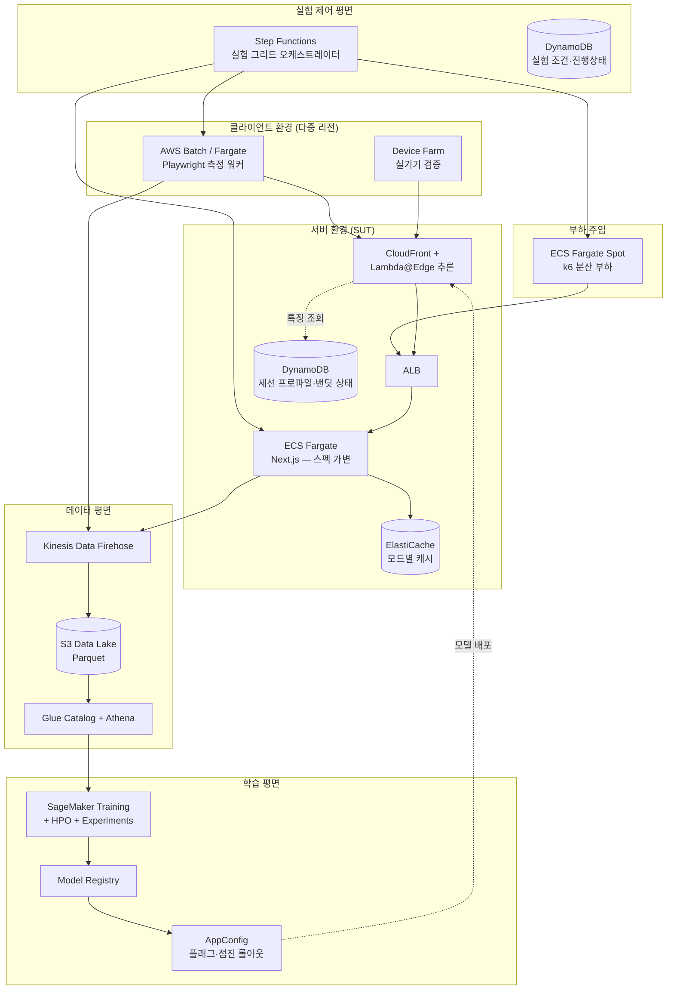

# 서버·클라이언트 환경 인지형 적응형 렌더링 전환 기법 연구

### — 머신러닝 기반 렌더링 모드 선택 및 AWS 기반 실험 인프라 설계

---

## 1. 연구 개요

### 1.1 연구 배경

웹 애플리케이션의 렌더링 방식(CSR, SSR, SSG, ISR, Streaming SSR, Islands Architecture)은 각각 초기 로딩 지연, 상호작용 준비 시간, 서버 자원 소모에서 서로 다른 트레이드오프를 가진다. 그러나 현재 대부분의 서비스는 **빌드 시점에 라우트별 렌더링 방식을 정적으로 고정**한다.

이 방식은 다음 현실을 반영하지 못한다.

- 동일한 페이지라도 **저사양 단말**에서는 하이드레이션 비용이 지배적이고, **저대역폭 환경**에서는 전송 바이트 수가 지배적이다.
- 서버 부하가 급증한 시점의 SSR은 TTFB를 악화시켜, 평시에 최적이던 선택이 피크 시간에는 최악이 된다.
- 사용자 환경 분포는 서비스·시간대·지역에 따라 지속적으로 변한다.

즉, **최적 렌더링 방식은 정적 상수가 아니라 런타임 환경의 함수**라는 것이 본 연구의 출발점이다.

### 1.2 연구 목적

1. 요청 시점의 서버 상태와 클라이언트 환경을 특징 벡터로 정량화하고, 이를 입력으로 최적 렌더링 모드를 선택하는 **머신러닝 기반 전환 정책**을 설계한다.
2. 서버·클라이언트 환경을 독립적으로 제어할 수 있는 **AWS 기반 재현 가능한 실험 인프라**를 구축하여 학습 데이터를 수집한다.
3. 고정 렌더링 방식 대비 성능 개선폭을 QoE 지표와 서버 자원 지표 양 측면에서 정량 검증한다.

### 1.3 연구 질문

| 번호 | 연구 질문 |
|---|---|
| RQ1 | 관측 가능한 서버·클라이언트 특징만으로 렌더링 모드별 성능을 유의미하게 예측할 수 있는가? |
| RQ2 | 예측 기반 동적 전환이 최적 고정 방식 대비 얼마나 개선되는가? 이론적 상한(오라클) 대비 몇 %를 달성하는가? |
| RQ3 | 어떤 환경 세그먼트에서 개선폭이 가장 큰가? (가설: 저사양·저대역폭·고부하 구간) |
| RQ4 | 특징 수집 및 추론 오버헤드가 개선폭을 상쇄하지 않는 실용적 구현이 가능한가? |

### 1.4 연구 범위

- **대상 프레임워크:** Next.js (App Router) — RSC, Streaming SSR, ISR을 단일 코드베이스에서 지원하여 모드 간 통제된 비교가 가능
- **포함:** 렌더링 모드 선택 정책, 학습·평가 방법론, 실험 인프라
- **제외:** 이미지 최적화, 폰트 로딩, 서드파티 스크립트 등 렌더링 모드와 직교하는 최적화 기법
- **부분 포함:** SEO 영향(하드 규칙으로 통제), 캐시 정합성(모드별 캐시 키 분리 수준까지)

---

## 2. 관련 연구 및 기술 동향

### 2.1 렌더링 아키텍처

- SSR/CSR 트레이드오프 분석 및 하이드레이션 비용 연구
- Partial Hydration / Islands Architecture (Astro, Qwik의 Resumability)
- React Server Components 및 Streaming SSR의 점진적 전달 모델
- 엣지 렌더링(Edge SSR)의 지연 감소 효과

### 2.2 적응형 콘텐츠 전달

- Adaptive Bitrate Streaming — 네트워크 상태 기반 품질 적응의 고전적 사례
- Client Hints / Network Information API 기반 반응형 자원 전달
- Google의 "Adaptive Loading" 패턴 — 기기 등급별 컴포넌트 분기(휴리스틱 수준)

### 2.3 시스템 최적화를 위한 학습 기법

- 학습 기반 시스템 파라미터 튜닝 (쿼리 최적화, 캐시 교체 정책, 컴파일러 휴리스틱)
- 컨텍스추얼 밴딧 기반 온라인 의사결정 및 오프폴리시 평가(OPE)

### 2.4 기존 연구와의 차별점

선행 연구는 렌더링 방식을 **비교·측정**하거나, 적응을 **수작업 임계값 규칙**으로 구현한다. 본 연구는 ① 서버 부하와 클라이언트 환경을 **동시에** 특징으로 사용하고, ② 모드별 성능을 예측하는 서로게이트 모델로 정책을 유도하며, ③ 반사실(counterfactual) 데이터 문제를 랩 전수 실험 + 필드 무작위화의 2단계 설계로 해결한다는 점에서 구별된다.

---

## 3. 문제 정의 및 시스템 설계

### 3.1 형식화

- 특징 벡터: $x \in \mathbb{R}^d$ (서버 상태 + 클라이언트 환경 + 라우트 특성)
- 전체 모드 집합: $M$ = {CSR, SSR, Streaming SSR, SSG/ISR, Islands}
- **실행 가능 행동 공간:** $M(x) = M_{\text{route}}(r) \cap M_{\text{request}}(x) \subseteq M$ (§3.1.1)
- 비용 함수:

$$J(x, m) = \sum_{i} w_i \cdot z_r(\text{QoE}_i) + \lambda \cdot \text{ServerCost}(x, m)$$

여기서 $z_r(\cdot)$은 라우트 $r$ 기준 z-score 정규화, QoE는 {LCP, INP, TBT, TTFB}이다. ServerCost의 정의는 §3.1.2에서 다룬다.

- 정책: $\pi(x) = \arg\min_{m \in M(x)} \hat{f}_\theta(x, m)$

#### 3.1.1 행동 공간은 라우트·요청마다 다르다

모든 모드가 모든 라우트에서 유효한 선택지인 것은 아니다. 개인화 페이지를 정적 캐시로 서빙하는 것은 "성능이 나쁜 선택"이 아니라 **애초에 선택지가 아니다.** 따라서 실행 가능성을 사후 오버라이드가 아니라 **행동 공간의 제약**으로 정식화한다.

| 제약 | 배제 모드 | 판정 시점 |
|---|---|---|
| $\texttt{personalizedRatio} > \theta_p$ | SSG/ISR | 빌드 |
| $\texttt{freshnessMs} < \texttt{revalidate}$ | SSG/ISR | 빌드 |
| 결제·인증 라우트 | SSR 외 전부 | 빌드 |
| 크롤러 UA | CSR, Islands | 런타임 |

$\theta_p = 0.2$로 둔다. 부분 개인화 라우트(예: 추천 배지가 붙은 목록형)는 공용 페이로드를 ISR로 캐시하고 개인화 영역만 클라이언트에서 채우는 하이브리드가 성립하므로, 완전 배제하면 ISR의 가장 현실적인 활용 사례를 관측하지 못한다.

**이것이 §3.5의 하드 규칙과 다른 점.** 오버라이드는 배포 시점만 막고 학습 시점은 막지 못한다. 실행 불가능한 조합을 측정해 라벨로 넣으면 — SSG는 캐시 히트 시 렌더 비용이 거의 0이므로 $J$가 최소가 된다 — 모델은 "개인화 라우트에서도 SSG가 최적"을 학습한다. 오버라이드가 서빙을 막더라도 **모델의 예측 자체가 틀린 상태**이므로 regret, 피처 중요도, 오라클 대비 달성률이 모두 왜곡된다. 따라서 $M(x)$는 데이터 수집(§5.2, §5.3), 평가(§7.2), 학습(§4.2) 전 단계에 일관되게 적용한다.

$M_{\text{route}}$는 빌드 타임에 산출해 룩업 테이블로 두고(§3.4의 라우트 특징과 함께), $M_{\text{request}}$만 런타임에 판정한다.

#### 3.1.2 ServerCost — 캐시 미스율로 정식화

ServerCost를 "요청당 렌더링 CPU 시간"으로 단순 정의하면 **SSG/ISR이 부당하게 유리해진다.** 캐시 히트 시 렌더 CPU가 0이기 때문이다. 그러나 SSG는 비용을 없앤 것이 아니라 재검증 시점으로 **옮긴** 것이므로, 요청당으로 환산(amortize)해야 공정한 비교가 된다.

이는 SSG만의 문제가 아니다. SSR도 CDN 캐시가 걸리면 렌더 비용을 내지 않는다. 모드별 특례를 두지 않고 일반형으로 정의한다.

$$\text{ServerCost}(x, m) = C_{\text{render}}(m) \cdot \text{missRate}(x, m) + C_{\text{serve}}(m) + \mu \cdot C_{\text{store}}(m)$$

| 항 | 의미 | 측정 |
|---|---|---|
| $C_{\text{render}}(m)$ | 모드별 1회 렌더 CPU 시간 | Idle 셀에서 per-request 측정 (§5.2) |
| $\text{missRate}(x, m)$ | 캐시 미스 비율 | 응답의 캐시 상태 헤더 집계 |
| $C_{\text{serve}}(m)$ | 캐시 히트 시에도 드는 서빙 비용 | 부하 구간 총 CPU에서 역산 |
| $C_{\text{store}}(m)$ | 캐시 저장소 점유 | 모드별 캐시 엔트리 크기 |

SSG/ISR의 미스율은 재검증 주기 $T$와 **해당 라우트의** 요청률 $\text{rps}_r$로 결정된다.

$$\text{missRate}(x, \text{ssg}) = \frac{1}{\max(1,\ \text{rps}_r \cdot T)}$$

$\max(1, \cdot)$이 희소 트래픽을 처리한다. $\text{rps}_r \cdot T < 1$이면 사실상 모든 요청이 미스이므로 SSR과 같은 비용이 되고, 트래픽이 많을수록 0에 수렴한다. **트래픽이 많을수록 SSG가 유리해진다는 관계 자체가 결과의 일부**이므로, 모델이 이를 학습하려면 $\text{rps}_r$이 특징에 포함되어야 한다(§3.4).

일반형을 쓰면 Streaming SSR의 숨은 비용도 드러난다. 스트리밍 응답은 청크 단위 전달이라 표준 캐시와 맞지 않아 $\text{missRate} \approx 1$이 고정이며, 단순 정의로는 이 불리함이 나타나지 않는다.

$C_{\text{store}}$ 항을 넣는 이유: SSG는 렌더를 하지 않는 대신 캐시 저장소(ElastiCache/CDN)를 점유한다. 렌더 CPU만 환산하고 저장 비용을 빼면 여전히 SSG 쪽으로 편향된다. $\mu$는 CPU-시간과 저장 비용의 환산 계수로, 인스턴스 단가 기준으로 고정한다.

### 3.2 설계 판단 — 왜 분류가 아니라 회귀 + argmin인가

| 방식 | 문제점 |
|---|---|
| 직접 분류 (최적 모드를 라벨로) | 정답 라벨을 사람이 정의해야 함, 근소한 차이와 압도적 차이를 구분 못 함, 모드 추가 시 재설계 |
| **서로게이트 회귀 + argmin (채택)** | 측정값이 곧 학습 신호, 모드 추가 시 후보만 확장, **예측 차이가 작을 때 "전환 안 함"을 판단 가능** |

세 번째 항목이 특히 중요하다. 전환에는 캐시 파편화와 모드 전환 오버헤드라는 고정 비용이 있으므로, **개선 기대값이 그 비용을 넘을 때만 전환**해야 한다. 회귀 모델은 이 마진 판단을 자연스럽게 제공한다.

### 3.3 $\lambda$ 설정 문제와 제약 최적화로의 재정식화

$\lambda$(지연 대 서버비용 교환비)를 임의로 고정하면 결과의 설득력이 떨어진다. 따라서 다음과 같이 제약 최적화로 재정식화한다.

$$\min_{\pi} \ \mathbb{E}[\text{QoE cost}] \quad \text{s.t.} \quad \mathbb{E}[\text{ServerCost}] \le B$$

$B$는 운영자가 지정하는 CPU 예산(예: 평균 CPU 사용률 65% 이하). 이중 상승법(dual ascent)으로 $\lambda$를 온라인 자동 조정한다.

$$\lambda_{t+1} = \max(0,\ \lambda_t + \eta(\widehat{\text{ServerCost}}_t - B))$$

이로써 $\lambda$는 하이퍼파라미터가 아니라 **예산 제약의 그림자 가격**이 되어 해석 가능해진다.

§3.1.2의 환산 정의를 쓰면 ServerCost의 스케일이 바뀌므로 $\lambda$의 초기값과 학습률 $\eta$를 재조정해야 한다. 다만 해석은 오히려 명확해진다 — 환산된 ServerCost는 요청당 실제 소모 자원이므로 예산 $B$("평균 CPU 사용률 65% 이하")와 단위가 직접 대응된다.

### 3.4 특징 설계

| 그룹 | 특징 | 수집 경로 |
|---|---|---|
| **서버 상태** | CPU/메모리 사용률, 이벤트 루프 지연(p95), 동시 요청 수, 렌더 큐 깊이, 최근 60초 TTFB p95, 전역 캐시 적중률 | 애플리케이션 메트릭 → 인메모리 공유 상태 |
| **라우트별 트래픽** | **요청률 $\text{rps}_r$, 라우트별 캐시 적중률** | 애플리케이션 메트릭 (라우트 차원으로 분리 집계) |
| **클라이언트 성능** | `deviceMemory`, `hardwareConcurrency`, UA-CH 기기 모델, 이전 세션 RUM 요약(LCP/TBT 중앙값) | Client Hints 헤더 + 세션 프로파일 쿠키 |
| **네트워크** | `effectiveType`, `downlink`, `RTT`, `saveData`, 엣지 PoP-오리진 거리 | Network Information API + CloudFront 헤더 |
| **라우트/콘텐츠** | 예상 DOM 노드 수, **모드별** 라우트 JS 번들 크기, 인터랙티브 컴포넌트 수, 데이터 페치 depth, 개인화 비율, 요구 신선도, SEO 중요도, **실행 가능 모드 집합 $M_{\text{route}}(r)$** | **빌드 타임 정적 분석**으로 사전 산출 후 룩업 테이블화 |
| **컨텍스트** | 첫 방문/재방문(SW 캐시 유무), 시간대, 봇 여부 | 요청 헤더 |

**콜드 스타트 처리:** 최초 요청에는 Client Hints가 없다. UA 문자열 → 기기 등급 사전 분포(GSMArena/기기 벤치마크 DB 기반)로 대체하고, 응답 시 실측 프로파일을 쿠키(및 DynamoDB)에 기록해 다음 요청부터 정밀 특징을 사용한다. 첫 요청은 보수적으로 기본 모드를 적용한다.

### 3.5 정책 안전장치

| 장치 | 내용 |
|---|---|
| **실행 가능 집합 제한** | 정책은 $M(x)$ 내에서만 argmin을 취한다(§3.1.1). 크롤러 UA·결제·인증·개인화 라우트의 제약이 여기서 강제되므로, 아래 장치들은 모두 $M(x)$ 위에서 동작한다 |
| **마진 기반 폴백** | $M(x)$ 내 1·2위 예측 차이 < $\tau$ 이거나 앙상블 분산이 임계 초과 → 기본 모드(Streaming SSR). $\|M(x)\| = 1$이면 폴백 없이 그 모드로 확정 |
| **전환 빈도 상한** | 동일 세션 내 모드 전환은 (세션, 라우트) 쌍당 1회로 제한, 세션 단위 결과 캐싱. 세션 전역으로 세면 첫 방문 라우트의 결정이 세션 내내 모든 라우트를 고정해, 라우트마다 최적 모드가 다르다는 §3.1.1의 전제 자체를 부정하게 된다 |
| **서킷 브레이커** | 하이드레이션 오류율 또는 5xx 급증 시 전 트래픽 기본 모드로 자동 복귀 |

---

## 4. 머신러닝 모델 및 학습 설계

### 4.1 모델 구성

| 단계 | 모델 | 선택 근거 |
|---|---|---|
| 기준선 | 고정 SSR / 고정 CSR / 휴리스틱 규칙(`effectiveType`+`deviceMemory` 임계값) | 비교군 |
| **주 모델** | **LightGBM 회귀** — 입력 $(x, m)$, 출력 $\hat{J}$ | 표 형태 데이터에서 강건, 학습 빠름, 특징 중요도 해석 가능 |
| 비교군 | 3층 MLP, Random Forest, Linear Regression | 모델 복잡도 대비 이득 검증 |
| 온라인 | **LinUCB / Thompson Sampling 컨텍스추얼 밴딧** | 배포 후 분포 변화 대응, 탐색-활용 균형 |
| 서빙 | GBDT → 깊이 5 결정트리 **증류**, JSON 직렬화 후 엣지 임베딩 | 추론 오버헤드 1ms 이하 목표 |

### 4.2 손실 함수

절대 성능값보다 **모드 간 순서**가 정책 품질을 결정하므로, MSE에 pairwise ranking loss를 결합한다.

$$L = L_{\text{MSE}} + \alpha \sum_{(m_i, m_j) \in M(x)^2} \max\big(0,\ \epsilon - (\hat{J}_{m_j} - \hat{J}_{m_i}) \cdot \mathrm{sign}(J_{m_j} - J_{m_i})\big)$$

$\alpha$는 검증셋의 pairwise accuracy를 기준으로 튜닝한다. 쌍은 **실행 가능 집합 $M(x)$ 내에서만** 구성한다. 배포 시 후보에 오르지 않는 모드와의 순서를 학습하는 것은 학습 신호의 낭비이며, pairwise accuracy 지표도 실제 정책 품질과 어긋나게 만든다.

### 4.3 불확실성 정량화

- **앙상블 분산:** 서로 다른 시드로 학습한 5개 LightGBM의 예측 분산
- **분위수 회귀:** $q_{0.1}, q_{0.5}, q_{0.9}$ 동시 학습으로 예측 구간 확보
- 활용: 마진 폴백 판단, 밴딧의 탐색 보너스 계산

### 4.4 온라인 적응 (2단계 배포)

1. **Phase 1 — 오프라인 정책 고정:** 서로게이트 모델 argmin 정책을 고정 배포, 5% 탐색 트래픽만 무작위 배정(단 $M(x)$ 내)
2. **Phase 2 — 컨텍스추얼 밴딧:** 서로게이트 예측을 사전(prior)으로 사용하는 LinUCB로 전환. 보상은 세션 종료 시 수집된 실측 $-J$

$$m_t = \arg\min_{m \in M(x_t)} \left( \hat{f}_\theta(x_t, m) - \beta \sqrt{x_t^\top A_m^{-1} x_t} \right)$$

밴딧 상태($A_m$, $b_m$)는 DynamoDB에 유지하며 스트림 컨슈머가 갱신한다. 탐색 보너스도 실행 가능 집합 내에서만 계산한다 — 배포되지 않을 모드에 탐색 예산을 쓰는 것은 낭비이며, 제약을 무시한 탐색은 실사용자에게 잘못된 콘텐츠를 서빙한다(§5.3).

---

## 5. 데이터 수집 설계

### 5.1 핵심 난점 — 반사실 문제

한 요청에는 한 가지 모드만 적용되므로 "다른 모드였다면 어땠는가"는 관측 불가능하다. 2단계 설계로 해결한다.

### 5.2 (A) 랩 전수 실험 — 사전학습용 완전 데이터

동일 조건에 대해 **모든 모드의 성능을 측정**하여 반사실 데이터를 직접 확보한다.

**완전요인 설계**

| 요인 | 수준 | 비고 |
|---|---|---|
| 기기 등급 | 4 (Flagship / Mid / Low / Very Low) | CPU 스로틀 1× / 2× / 4× / 6× |
| 네트워크 | 5 (5G / LTE / 3G Fast / 3G Slow / Offline-first) | 대역폭·RTT·패킷손실 조합. Offline-first는 완전 오프라인이 아니라 극단적 저대역·고지연(0.25Mbps, RTT 900ms)으로 해석한다 — 완전 오프라인은 페이지가 뜨지 않아 측정이 성립하지 않는다 |
| 라우트 | 25 (콘텐츠형·목록형·대시보드형·폼형·개인화형 각 5) | 정적 분석 특징이 다양하게 분포하도록 선정 |
| 서버 부하 | 4 (Idle / 30% / 65% / 90% CPU) | k6 배경 부하로 유지 |
| 렌더링 모드 | 라우트별 $\|M(r)\|$ (4~5) | 실행 불가능 조합은 그리드에서 제외 |
| ISR 캐시 상태 | 3 (miss / hit / stale) | SSG·ISR 셀에 한해 추가 축 |

**캐시 상태는 SSG 셀을 3배로 부풀린다.** SSG·ISR 셀 하나는 miss/hit/stale 세 셀이 되고, 나머지 모드는 요청마다 렌더하므로 상태가 하나뿐이다. 라우트별 셀 수를 쓰면

$$\text{조건 수} = 4 \times 5 \times 4 \times \sum_r \big(|M(r)| + 2 \cdot \mathbb{1}[\text{ssg} \in M(r)]\big)$$

**실행 불가능한 조합은 측정하지 않는다.** 측정한 뒤 걸러내는 것이 아니라 그리드 정의에서 빠진다(§3.1.1). $\theta_p = 0.2$ 기준으로 SSG/ISR이 가능한 라우트가 10종, 불가능한 라우트가 15종이면

$$80 \times \big(10 \times (5 + 2) + 15 \times 4\big) = 80 \times 130 = \textbf{10,400 셀}$$

이 되고, 셀당 30회 반복 → 312,000 측정이다. 최종 라우트 테이블이 확정되면 위 합을 다시 계산한다.

> **캐시 축을 조건 수에 반영하는 이유.** 이 항을 빼면 $80 \times 110 = 8{,}800$이 되지만, 그것은 캐시 상태를 통제하지 않는다는 뜻이고 그러면 **같은 셀 안에서 miss와 hit이 섞여 분산이 폭발한다.** 캐시 히트는 요청당 렌더 비용이 거의 0이고 미스는 전체 렌더 비용이 드므로, 두 상태를 한 셀로 묶으면 그 셀의 관측값은 두 분포의 혼합이 된다. 무엇보다 §3.1.2의 $\text{missRate}$를 **관측할 수 없게 된다** — 통제되지 않은 캐시 상태는 추정 대상이 아니라 잡음이 된다. 늘어난 1,600셀은 이 관측 가능성의 대가다.

> **`stale` 셀의 실행 비용 — 감수한다.** `revalidate` 창이 지나야 stale이 만들어지고, stale 응답 한 번이 백그라운드 재생성을 유발하므로 **반복마다 다시 기다려야 한다**(창이 60초면 반복당 ~62초). SSG 라우트 10종 × 80조건 × 30회 = 24,000회가 여기 걸려 **직렬 기준 413시간(17.2일)**이다.
>
> 재검증 주기를 짧게 만든 실험용 라우트 변형을 두는 대안이 있으나, 그러면 $T$가 다른 라우트를 만들어 §3.1.2의 $\text{missRate} = 1/\max(1, \text{rps}_r \cdot T)$가 라우트마다 다른 스케일을 갖게 된다. 캐시 축을 도입한 목적이 바로 그 항의 관측이므로, **측정 대상을 바꾸느니 시간을 쓰는 쪽을 택한다.**
>
> 실제 소요는 스케줄링에 달렸다. ISR 엔트리는 라우트 경로 단위로 공유되므로 **같은 라우트의 stale 셀은 병렬화할 수 없고**(두 워커가 같은 엔트리의 stale 타이머를 서로 리셋한다), 부하 수준은 SUT 전역 조건이라 수준끼리도 직렬이다. 병렬 상한은 SSG 라우트 수인 10이고, 그때 벽시계는 **약 41시간**이다. 더 줄이려면 대기 중에 다른 셀을 측정하도록 워커가 인터리빙해야 한다 — 비-stale 측정이 어차피 ~400시간이므로 대기 대부분을 그 안에 숨길 수 있다.

**측정 프로토콜**
- 매 반복마다 브라우저 프로파일 초기화(캐시·스토리지 클리어)
- 워밍업 3회 후 측정 시작 (JIT·커넥션 풀 안정화)
- 이상치는 MAD 기준 3σ 제거
- 조건 순서 무작위화 — 시간 흐름에 따른 인프라 드리프트가 특정 모드에 체계적으로 몰리지 않도록
- **ISR 캐시 상태를 셀 변수로 고정.** 미스·히트·stale을 명시적으로 통제하지 않으면 같은 셀 안에서 세 상태가 섞여 분산이 폭발하고, §3.1.2의 $\text{missRate}$를 관측할 수 없다
- $C_{\text{render}}(m)$은 Idle 셀에서만 per-request로 측정. 배경 부하가 있으면 `process.cpuUsage()` 델타에 동시 요청의 작업이 섞여 오염된다. 부하 구간에서는 총 CPU ÷ 처리 요청 수(실효값)를 별도로 기록한다

### 5.3 (B) 필드 무작위화 로그 — 미세조정 및 검증용

- 실트래픽의 5~10%에 렌더링 모드를 **무작위 배정**, 배정 확률(propensity)을 함께 기록
- **배정은 반드시 $M(x)$ 내에서만 수행한다.** 이는 데이터 품질이 아니라 안전 문제다 — 제약을 무시하고 배정하면 개인화 페이지에 stale 캐시가, 결제 라우트에 CSR이 실사용자에게 서빙된다
- 균등 배정 시 propensity는 $1/|M(x)|$ 이므로 **라우트마다 값이 다르다**(4분의 1 또는 5분의 1). 상수 $1/5$로 두고 IPS·DR을 계산하면 추정치가 편향되므로, 배정 시점의 $|M(x)|$를 로그에 함께 기록한다
- `web-vitals` 라이브러리로 실측 LCP/INP/CLS/TTFB 수집, `sendBeacon`으로 전송
- 편향 없는 로깅 데이터가 확보되어 **오프폴리시 평가(IPS/DR)**의 근거가 됨
- 전처리: 봇 트래픽 제거, 백그라운드 탭 세션 제거, 3초 미만 이탈 세션 제외

### 5.4 학습 파이프라인

1. **전처리** — 결측 Client Hints 대치, 수치형 표준화, 범주형 타깃 인코딩
2. **라벨 정규화** — 라우트별 z-score. *(이를 생략하면 "무거운 페이지 = 무조건 나쁨"이 학습되어 모드 간 비교 신호가 소실됨)*
3. **데이터 분할** — 시간 기준 분할 + **라우트/세션 그룹 분할 동시 적용**. 같은 세션이 학습·검증에 나뉘면 누수 발생
4. **학습** — 랩 데이터 사전학습 → 필드 로그 미세조정(도메인 적응)
5. **튜닝** — GroupKFold 5-fold + 베이지안 최적화
6. **오프라인 평가** — 오라클 대비 regret, Top-1 일치율, pairwise accuracy / 필드 로그 기준 IPS·SNIPS·Doubly Robust
7. **온라인 검증** — 1% → 10% → 50% 점진 롤아웃, 가드레일 자동 중단
8. **지속 학습** — 주 1회 재학습, 특징 분포 변화(PSI > 0.2) 감지 시 트리거

---

## 6. AWS 기반 실험 인프라 설계

본 연구의 핵심 요구사항은 **서버 환경과 클라이언트 환경을 각각 독립적으로, 재현 가능하게 조절**하는 것이다. AWS를 사용하는 이유는 ① 서버 스펙을 파라미터로 정의할 수 있고(Fargate task size), ② 클라이언트 측정 노드를 지리적으로 분산 배치해 실제 RTT를 확보할 수 있으며, ③ 실험 그리드를 오케스트레이션·자동화할 수 있기 때문이다.

### 6.1 전체 아키텍처



### 6.2 서버 환경 조절

**컴퓨트 티어 파라미터화 — ECS Fargate**

Fargate의 태스크 정의는 vCPU/메모리를 이산 값으로 명시하므로, **서버 스펙 자체를 실험 변수로 다룰 수 있다.**

| 서버 티어 | vCPU | 메모리 | 용도 |
|---|---|---|---|
| S | 0.5 | 1 GB | 자원 제약 환경 |
| M | 1 | 2 GB | 기준 |
| L | 2 | 4 GB | 여유 환경 |
| XL | 4 | 8 GB | 상한 |

- **Auto Scaling은 실험 중 비활성화**하고 `desiredCount`를 고정한다. 오토스케일링이 개입하면 "서버 부하"라는 독립 변수가 통제 불가능해진다.
- 부하 수준은 인스턴스 수가 아니라 **k6 가상 사용자 수**로 조절한다.
- CPU 사용률 목표(30/65/90%)에 도달할 때까지 VU를 이진 탐색으로 캘리브레이션하고, 그 값을 실험 조건에 고정 기록한다.

**추가 자원 제약 실험**
- `linuxParameters`의 `initProcessEnabled` 및 컨테이너 `cpu` 예약으로 세밀한 제약
- Node.js `--max-old-space-size`로 힙 상한 조절 → 메모리 압박 상황 재현
- 인위적 지연 주입: 데이터 페치 레이어에 설정 가능한 지연(0/50/200ms)을 삽입해 백엔드 의존성 지연 시나리오 구성

**관측**
- CloudWatch Container Insights로 태스크 단위 CPU/메모리/네트워크 수집
- 애플리케이션에서 `perf_hooks.monitorEventLoopDelay()`로 이벤트 루프 지연 → EMF(Embedded Metric Format)로 CloudWatch 전송
- 실험 실행 ID를 모든 로그·메트릭에 차원(dimension)으로 부착

### 6.3 클라이언트 환경 조절

클라이언트 조절은 **3계층**으로 구성한다. 계층이 올라갈수록 현실성은 높고 처리량은 낮다.

#### 계층 1 — 에뮬레이션 (대량 데이터 수집용, 전체의 ~95%)

**AWS Batch on Fargate**에서 Playwright 컨테이너를 실행하고, Chrome DevTools Protocol로 환경을 정밀 제어한다.

```javascript
const client = await page.context().newCDPSession(page);

// CPU 스로틀링 — 기기 등급 에뮬레이션
await client.send('Emulation.setCPUThrottlingRate', { rate: 4 }); // Low-tier

// 네트워크 조건 — 대역폭/지연 에뮬레이션
await client.send('Network.emulateNetworkConditions', {
  offline: false,
  downloadThroughput: 1.6 * 1024 * 1024 / 8,  // 3G Fast
  uploadThroughput:   0.75 * 1024 * 1024 / 8,
  latency: 150
});

// 기기 특성 오버라이드 (Client Hints 일관성 유지)
await client.send('Emulation.setDeviceMetricsOverride', { ... });
```

| 기기 등급 | CPU 스로틀 | deviceMemory | hardwareConcurrency | 대응 실기기 |
|---|---|---|---|---|
| Flagship | 1× | 8 | 8 | 최신 플래그십 |
| Mid | 2× | 4 | 6 | 중급기 |
| Low | 4× | 2 | 4 | 보급형 |
| Very Low | 6× | 0.5 | 2 | 저사양 구형 |

| 네트워크 | 하향 | 상향 | RTT | 손실률 |
|---|---|---|---|---|
| 5G | 100 Mbps | 50 Mbps | 10 ms | 0% |
| LTE | 30 Mbps | 15 Mbps | 40 ms | 0% |
| 3G Fast | 1.6 Mbps | 0.75 Mbps | 150 ms | 0.5% |
| 3G Slow | 400 Kbps | 400 Kbps | 400 ms | 2% |
| Save-Data | LTE + `Save-Data: on` | | | |

> **주의:** CDP의 네트워크 에뮬레이션은 애플리케이션 계층에서 동작하므로 TCP/TLS 핸드셰이크 지연이 완전히 반영되지 않는다. 이를 보완하기 위해 계층 2·3을 병행한다.

#### 계층 2 — 실제 네트워크 경로 (다중 리전 배치)

측정 워커를 여러 리전에 배치해 **실제 물리적 RTT**를 확보한다. 오리진은 서울(`ap-northeast-2`) 고정.

| 워커 리전 | 오리진까지 실측 RTT(대략) | 시나리오 |
|---|---|---|
| ap-northeast-2 (서울) | ~5 ms | 국내 |
| ap-northeast-1 (도쿄) | ~35 ms | 근거리 해외 |
| ap-southeast-1 (싱가포르) | ~75 ms | 중거리 |
| us-east-1 (버지니아) | ~180 ms | 원거리 |
| eu-west-1 (아일랜드) | ~250 ms | 최원거리 |

- 커널 수준 정밀 제어가 필요한 경우 EC2 워커에서 `tc qdisc`(netem)로 지연·지터·손실을 직접 형성한다. Fargate는 커널 파라미터 접근이 제한되므로 이 용도에는 EC2를 사용한다.
- CloudFront를 경유/우회하는 두 경로를 모두 측정해 엣지 캐싱 효과를 분리한다.

#### 계층 3 — 실기기 검증 (전체의 ~5%)

**AWS Device Farm**에서 실제 안드로이드/iOS 단말로 부분집합을 재측정한다.

- 목적: 에뮬레이션 결과의 **외적 타당성 검증**
- 방법: 대표 조건 200~300셀을 실기기로 반복 측정 → 에뮬레이션 결과와의 상관계수(Pearson/Spearman) 및 계통 편차 산출
- 편차가 체계적이면 **보정 계수(calibration factor)** 를 회귀로 추정해 랩 데이터에 적용
- 이 절차가 있어야 "CPU 4× 스로틀 = 보급형 단말"이라는 매핑이 근거를 갖는다

#### 측정 지표 수집

```javascript
// 워커 내부에서 web-vitals attribution 빌드 사용
import { onLCP, onINP, onCLS, onTTFB } from 'web-vitals/attribution';
// → 실험 메타데이터(experiment_id, cell_id, mode, device_tier, net_tier)와 함께
//   Kinesis Firehose로 전송
```

### 6.4 부하 주입

- **ECS Fargate Spot**에서 k6를 분산 실행 (비용 최대 70% 절감)
- 부하 프로파일: ramp-up 60초 → steady 300초 → 이 구간에서만 측정 수행 → ramp-down
- 부하 생성기와 측정 워커는 **서로 다른 서브넷/보안그룹**에 배치해 자원 간섭 배제
- 측정 요청은 별도 헤더로 태깅해 부하 트래픽과 로그상 분리

### 6.5 데이터 파이프라인

| 단계 | 서비스 | 구성 |
|---|---|---|
| 수집 | API Gateway (HTTP API) 또는 CloudFront + Lambda | `sendBeacon` 엔드포인트, CORS 최소 허용 |
| 스트리밍 | Kinesis Data Firehose | 60초 또는 128MB 버퍼, Lambda로 스키마 변환 |
| 저장 | S3 | Parquet + Snappy, `s3://.../rum/dt=YYYY-MM-DD/exp=<id>/` 파티셔닝 |
| 카탈로그 | Glue Crawler + Data Catalog | 스키마 자동 추론 |
| 조회 | Athena | 집계 쿼리, 학습 데이터셋 추출 |
| 라이프사이클 | S3 Lifecycle | 90일 후 Glacier IR 전환 |

> 필드 단계에서는 **CloudWatch RUM**을 병행 사용해 실사용자 Core Web Vitals를 수집하고, 자체 비콘 데이터와 교차 검증한다.

### 6.6 학습 인프라

| 구성 | 서비스 | 설명 |
|---|---|---|
| 데이터셋 생성 | SageMaker Processing | Athena 쿼리 → 전처리 → S3 |
| 학습 | SageMaker Training Job | LightGBM script mode, `ml.m5.2xlarge` |
| 튜닝 | SageMaker Automatic Model Tuning | 베이지안 최적화, 30~50 trial |
| 실험 추적 | SageMaker Experiments | 조건·하이퍼파라미터·지표 버전 관리 |
| 온라인 특징 | SageMaker Feature Store (또는 DynamoDB) | 세션 프로파일 저빈도 조회 |
| 모델 관리 | SageMaker Model Registry | 승인 워크플로 후 배포 |
| 스케줄링 | EventBridge + Step Functions | 주간 재학습, PSI 임계 초과 시 트리거 |

### 6.7 추론·서빙 아키텍처

추론 지연이 곧 TTFB 증가분이므로, **네트워크 홉이 없는 인프로세스 추론**을 원칙으로 한다.

```
[요청]
  ↓
CloudFront (viewer-request)
  ↓
Lambda@Edge — 증류된 결정트리(JSON, ~50KB) 인메모리 평가
  │  · 특징: Client Hints 헤더 + 세션 프로파일 쿠키 + 서버 상태 스냅샷
  │  · 서버 상태는 30초 주기로 갱신되는 값을 Lambda 환경변수/캐시로 주입
  ↓  → x-render-mode 헤더 부착
ALB → ECS Fargate (Next.js)
  ↓  헤더에 따라 렌더링 경로 분기
[응답]
```

- **SageMaker 실시간 엔드포인트는 섀도 추론·오프라인 비교 전용**으로만 사용한다. 요청 경로에 두면 네트워크 왕복(수십 ms)이 발생해 개선 효과를 상쇄한다.
- 증류 트리를 사용하는 이유: LightGBM 앙상블 전체(수 MB)는 Lambda@Edge 패키지 제한과 콜드스타트 측면에서 불리하다. 깊이 5 단일 트리는 수십 μs 내 평가되며, 증류 손실은 오프라인에서 Top-1 일치율로 검증한다.
- 서버 상태 특징의 신선도: 정확한 실시간 값 대신 **30초 지연된 근사값**을 사용한다. 부하는 초 단위로 급변하지 않으며, 실시간 조회를 위한 DynamoDB 왕복이 오히려 손해다.
- 세션 단위 캐싱: 동일 세션의 후속 요청은 최초 결정을 재사용해 추론 호출 자체를 제거한다.

### 6.8 실험 오케스트레이션

**Step Functions Distributed Map**으로 실험 그리드를 병렬 실행한다.

```
[실험 정의 JSON(10,400 셀) → S3]
   ↓
Step Functions Distributed Map (최대 동시성 200)
   ├─ 1. 서버 티어 배포 (ECS 서비스 업데이트 + 안정화 대기)
   ├─ 2. 배경 부하 시작 (k6, 목표 CPU 도달까지 대기)
   ├─ 3. 측정 워커 실행 (Batch job, 30회 반복)
   ├─ 4. 결과 검증 (이상치·실패율 확인, 실패 시 재시도)
   └─ 5. 결과 적재 + 진행 상태 DynamoDB 갱신
   ↓
[완료 → EventBridge → SageMaker 학습 파이프라인 트리거]
```

- 실패 셀은 최대 3회 재시도, 그래도 실패하면 격리 큐에 기록
- 실험 전체를 중단·재개할 수 있도록 셀 단위 체크포인트 유지

### 6.9 비용 관리

| 항목 | 절감 전략 |
|---|---|
| 측정 워커 | Fargate Spot + Batch 큐 우선순위, 야간 배치 실행 |
| 부하 생성기 | Fargate Spot 전용 |
| SUT | 실험 구간 외 `desiredCount=0` |
| Device Farm | 대표 부분집합만, 미터드 요금제 |
| S3 | Parquet 압축 + Lifecycle 정책 |
| 전반 | 모든 리소스에 `Project`/`ExperimentId` 태그 → Cost Explorer 추적, AWS Budgets 알림 |

**개략 추정(1회 전체 그리드 기준):** 측정 워커 $150~250 / 부하 생성 $30~60 / SUT $40~80 / Device Farm $80~150 / 저장·조회 $20~40 / SageMaker 학습·튜닝 $50~100 → **총 $370~680 수준**. 반복 실험을 고려해 예산을 3~4배로 계획한다.

### 6.10 재현성 확보

- **IaC:** 전 인프라를 AWS CDK(TypeScript)로 정의, Git 버전 관리
- **컨테이너 고정:** 측정 워커·SUT 이미지를 **다이제스트(sha256)로 핀 고정**. 태그(`:latest`)는 재현성을 파괴한다
- **시드 고정:** 학습 시드, 조건 순서 무작위화 시드를 실험 메타데이터에 기록
- **버전 기록:** Chrome/Playwright/Node/Next.js 버전을 각 실험 레코드에 포함 — 브라우저 업데이트만으로 성능 특성이 바뀔 수 있음
- **아티팩트 공개:** 익명화된 데이터셋, IaC 코드, 학습 스크립트를 리포지토리로 공개

---

## 7. 평가 설계

### 7.1 평가 지표

| 범주 | 지표 |
|---|---|
| **모델 품질** | RMSE/MAE, pairwise ranking accuracy, Top-1 일치율, **오라클 대비 regret** |
| **시스템 성능** | LCP·INP·TBT·TTFB의 p50/p75/p95, 처리량(RPS), 서버 CPU 사용률 |
| **비용 효율** | 환산 ServerCost(§3.1.2), 모드별 캐시 미스율, 동일 SLA 하 필요 태스크 수 |
| **오버헤드** | 특징 수집 + 추론 지연 (**목표: TTFB 증가 < 2 ms**) |
| **안정성** | 하이드레이션 오류율, 모드 전환 빈도, 캐시 적중률 변화 |

### 7.2 비교 대상

1. 고정 CSR / 고정 SSR / 고정 Streaming SSR / 고정 SSG (각각 단일 최적 고정 정책)
2. 휴리스틱 규칙 정책 (`effectiveType` + `deviceMemory` 임계값)
3. **제안 기법 (서로게이트 argmin)**
4. 제안 기법 + 온라인 밴딧
5. **오라클** — $M(x)$ **내에서** 사후적으로 최적 모드를 아는 상한선

`(3) - (1)` 이 실용적 개선폭이고, `(3)/(5)` 가 이론적 상한 대비 달성률이다. 두 수치를 함께 보고해야 결과 해석이 가능하다.

**모든 비교군은 $M(x)$를 존중한다.** 고정 정책도 예외가 아니다 — 개인화 라우트에서 "고정 SSG"는 성립하지 않으므로 기본 모드(Streaming SSR)로 폴백하며, 이 **폴백 발생률을 함께 보고**해야 한다. 폴백이 잦은 고정 정책은 이름과 달리 실제로는 혼합 정책이므로, 이를 밝히지 않으면 `(3) - (1)`의 해석이 왜곡된다.

오라클을 $M(x)$로 제한하지 않으면 실행 불가능한 모드를 상한으로 잡게 되어, `(3)/(5)`가 영원히 100%에 도달할 수 없는 인위적 지표가 된다.

### 7.3 세그먼트 분석

전체 평균 개선폭은 작더라도 특정 세그먼트에서 큰 이득이 있을 수 있다. 다음 축으로 분해 보고한다.

- 기기 등급별 (Flagship ↔ Very Low)
- 네트워크 등급별 (5G ↔ 3G Slow)
- 서버 부하 수준별 (Idle ↔ 90%)
- 라우트 유형별 (콘텐츠형 ↔ 대시보드형)

**가설:** 저사양·저대역폭·고부하 교집합에서 개선폭이 최대일 것이다. 반대로 Flagship + 5G + Idle 구간에서는 유의미한 차이가 없을 것으로 예상되며, 이 경우 "전환하지 않음" 판단이 올바르게 작동하는지가 검증 포인트가 된다.

### 7.4 통계적 검증

- 조건별 30회 반복 → 부트스트랩 신뢰구간(10,000 resample)
- 다중 비교 보정: Benjamini-Hochberg FDR
- 효과 크기 병기 (Cliff's delta) — p값만으로는 실용적 의미를 판단할 수 없음

---

## 8. 리스크 및 대응

| 리스크 | 영향 | 대응 |
|---|---|---|
| 랩 데이터와 실환경 분포 차이 | 모델 일반화 실패 | 필드 미세조정, Device Farm 보정, 랩은 사전학습 용도로만 |
| 추론 오버헤드가 이득 상쇄 | 연구 전제 붕괴 | 트리 증류 + 인프로세스 추론 + 세션 캐싱, 오버헤드를 독립 지표로 보고 |
| 모드 전환에 따른 캐시 파편화 | 적중률 하락 | 모드별 캐시 키 분리, 전환 빈도 상한, 캐시 적중률을 가드레일 지표화 |
| 개선폭이 통계적으로 미미 | 결론 약화 | 세그먼트 분석으로 유효 구간 특정, **음성 결과도 유의미한 기여로 서술** |
| 실행 불가능 모드가 학습·평가에 유입 | 모델이 "항상 SSG"를 학습, 배포 시 잘못된 콘텐츠 서빙 | $M(x)$를 수집·학습·평가·배정 전 단계에 일관 적용(§3.1.1), 그리드 생성 시 자동 검증 |
| ServerCost 정의로 인한 모드 편향 | SSG가 부당하게 유리해져 결론 왜곡 | 캐시 미스율 기반 환산 정의(§3.1.2), 캐시 상태를 셀 변수로 통제, 저장 비용 항 포함 |
| 무작위 탐색의 사용자 경험 저해 | 운영 리스크 | 탐색 비율 5% 제한, 명백한 열위 모드는 후보에서 사전 제외 |
| AWS 인프라 변동성(Spot 회수 등) | 측정 오염 | 셀 단위 재시도, 이상치 검출, 조건 순서 무작위화 |
| SEO 영향 | 서비스 리스크 | 크롤러 SSR 하드 고정, 색인 상태를 롤아웃 가드레일에 포함 |

---

## 9. 추진 일정

| 기간 | 주요 활동 | 산출물 |
|---|---|---|
| **1개월** | 문헌 조사, 목적함수·특징 정의 확정, 벤치마크 앱 설계 | 연구계획서, 특징 명세 |
| **2개월** | AWS 인프라 CDK 구축, 벤치마크 앱 5개 모드 구현, 측정 파이프라인 검증 | IaC 코드, 측정 워커 |
| **3개월** | 랩 전수 실험 실행, Device Farm 보정 실험 | 랩 데이터셋(10,400 셀) |
| **4개월** | 서로게이트 모델 학습·튜닝, 오프라인 평가, 증류 및 경량화 | 학습된 모델, 오프라인 결과 |
| **5개월** | Lambda@Edge 추론 구현, 필드 무작위화 로그 수집, 오프폴리시 평가 | 서빙 시스템, 필드 데이터셋 |
| **6개월** | 온라인 A/B, 밴딧 확장, 세그먼트 분석, 논문 작성 | 최종 결과, 논문 초고 |

---

## 10. 기대 효과 및 산출물

### 10.1 학술적 기여

- 서버 부하와 클라이언트 환경을 **동시에** 고려하는 렌더링 선택 문제의 형식화
- 반사실 데이터 문제에 대한 실용적 2단계 수집 방법론 제시
- 렌더링 모드 선택에서 오라클 대비 달성 가능한 성능 상한의 실증적 규명

### 10.2 실무적 기여

- 환경별 최적 렌더링 선택을 통한 체감 로딩 속도 개선 및 서버 자원 효율화
- 저사양·저대역폭 사용자군의 접근성 향상 — 가장 소외되던 세그먼트에 가장 큰 이득
- 재현 가능한 AWS 실험 인프라 템플릿(CDK) 공개

### 10.3 산출물

1. 연구 논문 1편
2. AWS CDK 기반 실험 인프라 오픈소스
3. 익명화 데이터셋 (랩 10,400 셀 + 필드 로그)
4. Next.js 미들웨어 참조 구현
5. 렌더링 전환 정책 실무 가이드라인

---

## 부록 A. AWS 서비스 매핑 요약

| 연구 요구사항 | AWS 서비스 | 핵심 설정 |
|---|---|---|
| 서버 스펙 조절 | ECS Fargate | Task Definition의 cpu/memory 파라미터화, Auto Scaling 비활성화 |
| 서버 부하 조절 | ECS Fargate Spot + k6 | VU 수 이진 탐색 캘리브레이션 |
| 클라이언트 CPU/네트워크 조절 | AWS Batch + Playwright/CDP | `setCPUThrottlingRate`, `emulateNetworkConditions` |
| 실제 네트워크 지연 | 다중 리전 워커 (5개 리전) | 오리진 서울 고정 |
| 커널 수준 네트워크 제어 | EC2 + tc/netem | Fargate 제약 회피 |
| 실기기 검증 | AWS Device Farm | 대표 부분집합, 보정 계수 산출 |
| 엣지 추론 | CloudFront + Lambda@Edge | viewer-request, 증류 트리 인메모리 평가 |
| 세션 프로파일·밴딧 상태 | DynamoDB | 온디맨드 모드, TTL 설정 |
| 캐시 | ElastiCache for Redis | 모드별 캐시 키 분리 |
| RUM 수집 | Kinesis Firehose → S3 | Parquet, 실험 ID 파티셔닝 |
| 데이터 조회 | Glue + Athena | 학습 데이터셋 추출 |
| 모델 학습·튜닝 | SageMaker Training / HPO / Experiments | LightGBM script mode |
| 모델 배포 관리 | Model Registry + AppConfig | 승인 워크플로, 퍼센트 기반 점진 롤아웃 |
| 실험 오케스트레이션 | Step Functions Distributed Map | 동시성 200, 셀 단위 체크포인트 |
| 관측 | CloudWatch (Container Insights, EMF, RUM) | 실험 ID를 차원으로 부착 |
| 인프라 정의 | AWS CDK | 컨테이너 이미지 다이제스트 핀 고정 |

## 부록 B. 실험 그리드 요약

| 요인 | 수준 수 | 값 |
|---|---|---|
| 기기 등급 | 4 | Flagship(1×) / Mid(2×) / Low(4×) / Very Low(6×) |
| 네트워크 | 5 | 5G / LTE / 3G Fast / 3G Slow / Save-Data |
| 워커 리전 | 5 | 서울 / 도쿄 / 싱가포르 / 버지니아 / 아일랜드 |
| 라우트 | 25 | 콘텐츠·목록·대시보드·폼·개인화 각 5 |
| 서버 티어 | 4 | S(0.5vCPU) / M(1) / L(2) / XL(4) |
| 서버 부하 | 4 | Idle / 30% / 65% / 90% CPU |
| 렌더링 모드 | 라우트별 4~5 | CSR / SSR / Streaming SSR / SSG·ISR / Islands — 단 $M(r)$로 제한(§3.1.1) |
| ISR 캐시 상태 | 3 | miss / hit / stale — SSG·ISR 셀에만 적용 |

*주 실험은 서버 티어를 M으로 고정한 **10,400셀** 그리드로 진행하고($\theta_p = 0.2$ 기준, §5.2), 서버 티어·워커 리전은 별도 축소 그리드(각 500~1,000셀)로 부가 분석한다. 전체 교차는 비용·시간상 비현실적이므로, 부분요인 설계(fractional factorial)로 주효과와 주요 2차 교호작용만 추정한다.*

*그리드 크기는 최종 라우트 테이블에 따라 달라지므로, 생성 시 `candidateModes(route)`로 산출한 $\sum_r |M(r)|$과 **캐시 축을 반영한 총 셀 수**를 함께 실험 메타데이터에 기록한다. 둘 다 필요하다 — 전자는 행동 공간의 크기이고 후자는 실제 측정량이다.*
